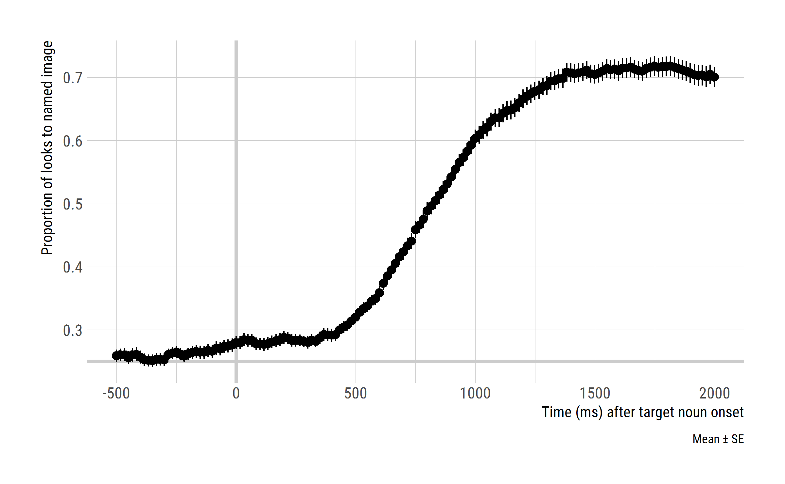
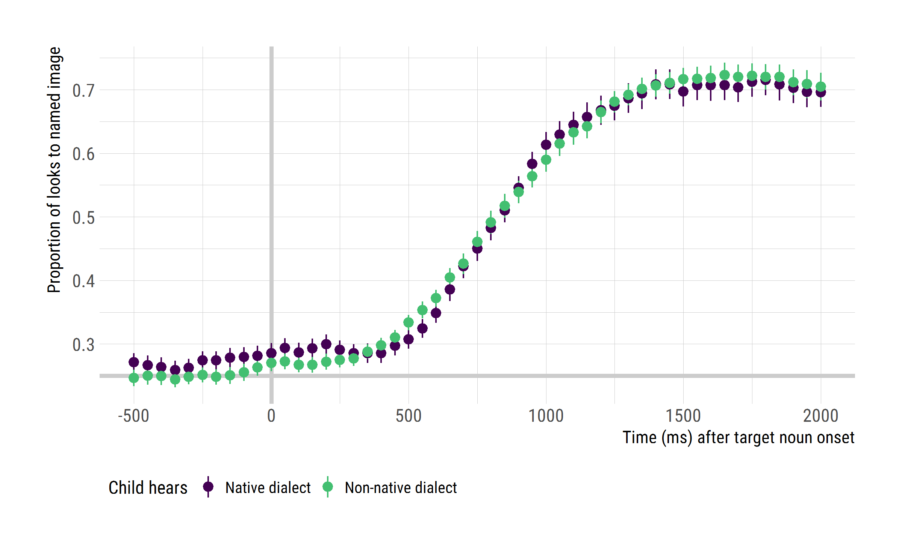
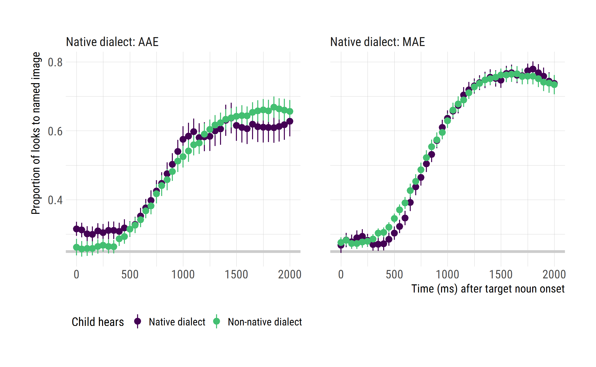
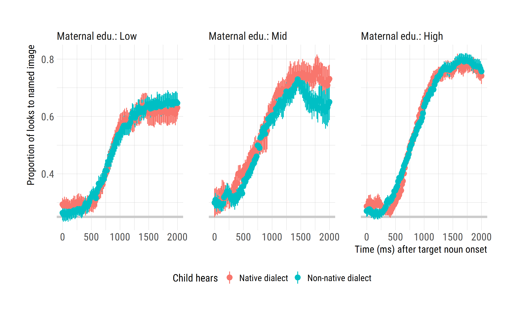

Comparison of word recognition performance in native versus unfamiliar dialects for preschool age children
================
Tristan Mahr
2017-03-28

Problem statement
-----------------

ME would like to look at the data for the RWL task for participants in the Dialect Switch study. I will

-   summarize child-level measurements for the participants in these studies
-   wrangle and reduce the eyetracking data
-   plot the main effect of dialect on familiar word recognition

Find the eyetracking blocks
---------------------------

Connect to database:

``` r
library(dplyr)
library(L2TDatabase)

# Work relative to RStudio project
wd <- rprojroot::find_rstudio_root_file()
dir_here <- file.path(wd, "inst", "analyses", "ci_matching")
cnf_file <- file.path(wd, "inst", "l2t_db.cnf")

# Connect to the individual databases
l2t_main <- l2t_connect(cnf_file, "l2t")
l2t_backend <- l2t_connect(cnf_file, "backend")
l2t_eyetracking <- l2t_connect(cnf_file, "eyetracking")
```

### Determine which blocks of RWL used which stimuli

JE says that we should only use the experiments that used the re-recorded stimuli for TimePoint2. We modified the stimuli at TimePoint2 so that the two dialect versions had similar durations.

These are the tables in the eyetracking database.

``` r
src_tbls(l2t_eyetracking)
#>  [1] "BlockAttributes"          "Blocks"                  
#>  [3] "Looks"                    "TrialAttributes"         
#>  [5] "Trials"                   "q_BlockAttributesByStudy"
#>  [7] "q_BlocksByStudy"          "q_LooksByStudy"          
#>  [9] "q_MissingDataByBlock"     "q_TrialAttributesByStudy"
#> [11] "q_TrialsByStudy"
```

Tables with `q_` at the front are queries which contain helpful information (like Study and ResearchID) alongside the main data in the table. We use the `q_TrialAttributesByStudy` table to get information about each eyetracking trial.

``` r
# Get the audio information from trial attributes. TargetEnd marks the offset of
# the wav file.
rwl_trials_attrs <- tbl(l2t_eyetracking, "q_TrialAttributesByStudy") %>% 
  filter(Task == "RWL", TrialAttribute_Name %in% c("Audio", "TargetEnd")) %>% 
  collect(n = Inf)

# Figure out the stimuli used for TP1, TP2, TP3
target_lengths <- rwl_trials_attrs %>% 
  # Convert wide to long and remove duplicate rows to get one row per audio file
  tidyr::spread(TrialAttribute_Name, TrialAttribute_Value) %>% 
  select(Study, Audio, TargetEnd) %>% 
  distinct() %>% 
  na.omit() %>% 
  # Extract dialect and keep only rows from longitudinal studies
  mutate(Dialect = substr(Audio, 1, 3)) %>% 
  select(Study, Dialect, Audio, TargetEnd) %>% 
  filter(Study %in% c("TimePoint1", "TimePoint2", "TimePoint3"))
target_lengths
#> # A tibble: 266 × 4
#>         Study Dialect            Audio TargetEnd
#>         <chr>   <chr>            <chr>     <chr>
#> 1  TimePoint1     SAE  SAE_flag_911_16       816
#> 2  TimePoint1     SAE  SAE_drum_613_10       816
#> 3  TimePoint1     SAE   SAE_ring_712_4       816
#> 4  TimePoint1     SAE   SAE_swan_411_8       816
#> 5  TimePoint1     SAE   SAE_kite_212_8       816
#> 6  TimePoint1     SAE  SAE_bell_911_12       816
#> 7  TimePoint1     SAE  SAE_heart_213_6       816
#> 8  TimePoint1     SAE SAE_bread_911_20       816
#> 9  TimePoint1     SAE  SAE_vase_411_10       816
#> 10 TimePoint1     SAE  SAE_gift_411_12       816
#> # ... with 256 more rows
```

It looks like TP1 SAE stimuli were uniformly 816 ms long and the AAE ones were 567 ms. We can use this fact to label blocks as using TP1 stimuli or not.

``` r
# Get the audio file info for each block, figure out the stimuli used
block_stim <- rwl_trials_attrs %>% 
  tidyr::spread(TrialAttribute_Name, TrialAttribute_Value) %>% 
  select(BlockID, TrialID, Study, Audio, TargetEnd) %>% 
  na.omit() %>% 
  mutate(Dialect = substr(Audio, 1, 3)) %>% 
  # If the durations in a block are all the same and equal to one of the TP1
  # durations, mark it as TP1.
  group_by(BlockID) %>% 
  mutate(StimSet = ifelse(Dialect == "SAE" & all(TargetEnd == 816), 
                          "TP1", "Not TP1"), 
         StimSet = ifelse(Dialect == "AAE" & all(TargetEnd == 567), 
                          "TP1", StimSet)) %>% 
  ungroup() %>% 
  select(BlockID, Study, Dialect, StimSet) %>% 
  distinct() %>% 
  arrange(BlockID)
block_stim
#> # A tibble: 1,383 × 4
#>    BlockID      Study Dialect StimSet
#>      <int>      <chr>   <chr>   <chr>
#> 1        1 TimePoint1     SAE     TP1
#> 2        2 TimePoint1     SAE     TP1
#> 3        3 TimePoint1     SAE     TP1
#> 4        4 TimePoint1     SAE     TP1
#> 5        5 TimePoint1     SAE     TP1
#> 6        6 TimePoint1     SAE     TP1
#> 7        7 TimePoint1     SAE     TP1
#> 8        8 TimePoint1     SAE     TP1
#> 9        9 TimePoint1     SAE     TP1
#> 10      10 TimePoint1     SAE     TP1
#> # ... with 1,373 more rows
```

Count the number of blocks with each type of stimuli in the dialect-varying studies.

``` r
# Check that dialect switch got 2 different sets of stimuli
block_stim %>% 
  filter(Study == "DialectSwitch") %>% 
  count(Dialect, StimSet) %>% 
  rename(nBlocks = n) %>% 
  ungroup()
#> # A tibble: 4 × 3
#>   Dialect StimSet nBlocks
#>     <chr>   <chr>   <int>
#> 1     AAE Not TP1      42
#> 2     AAE     TP1      45
#> 3     SAE Not TP1      41
#> 4     SAE     TP1      45

block_stim %>% 
  filter(Study == "MaternalEd") %>% 
  count(Dialect, StimSet) %>% 
  rename(nBlocks = n) %>% 
  ungroup()
#> # A tibble: 4 × 3
#>   Dialect StimSet nBlocks
#>     <chr>   <chr>   <int>
#> 1     AAE Not TP1      20
#> 2     AAE     TP1       1
#> 3     SAE Not TP1      19
#> 4     SAE     TP1       1
```

Now, we can identify which blocks got TP2 versions of the RWL experiment.

Download block and child demographic information
------------------------------------------------

Download the records for the blocks of the RWL experiment.

``` r
# Get the dialects of each block from the table of block attributes
block_dialects <- tbl(l2t_eyetracking, "BlockAttributes") %>% 
  select(-BlockAttributeID, -BlockAttribute_Timestamp) %>% 
  collect() %>% 
  # Convert from long to wide format
  tidyr::spread(BlockAttribute_Name, BlockAttribute_Value) %>% 
  select(BlockID, Dialect)

# Get the block information (child, date, filename) for the RWL task
rwl_blocks <- tbl(l2t_eyetracking, "Blocks") %>% 
  select(-Block_Timestamp) %>% 
  filter(Block_Task == "RWL") %>% 
  collect() %>% 
  inner_join(block_dialects) %>% 
  left_join(block_stim)
rwl_blocks
#> # A tibble: 1,383 × 10
#>    BlockID ChildStudyID       Block_Basename      Block_DateTime Block_Age
#>      <int>        <int>                <chr>               <chr>     <int>
#> 1        1            2 RWL_Block1_601L28MS1 2012-11-02 09:17:53        28
#> 2        2            3 RWL_Block1_602L34MS2 2012-11-27 09:08:54        34
#> 3        3            3 RWL_Block2_602L34MS2 2012-11-08 09:35:21        34
#> 4        4            4 RWL_Block1_603L35FS2 2012-11-08 16:33:29        35
#> 5        5            4 RWL_Block2_603L35FS2 2012-12-07 14:18:02        36
#> 6        6            5 RWL_Block1_604L30FS1 2012-12-03 10:14:41        31
#> 7        7            5 RWL_Block2_604L30FS1 2012-11-09 10:37:36        30
#> 8        8            6 RWL_Block1_605L31MS1 2012-11-12 13:46:32        31
#> 9        9            6 RWL_Block2_605L31MS1 2012-11-26 13:45:49        31
#> 10      10            7 RWL_Block2_606L28MS1 2012-11-13 12:09:25        28
#> # ... with 1,373 more rows, and 5 more variables: Block_Task <chr>,
#> #   Block_Version <chr>, Dialect <chr>, Study <chr>, StimSet <chr>
```

Download child-level information.

``` r
child_info <- tbl(l2t_backend, "Child") %>% 
  left_join(tbl(l2t_backend, "ChildStudy")) %>% 
  left_join(tbl(l2t_backend, "Study")) %>% 
  collect() %>% 
  left_join(collect(tbl(l2t_main, "Maternal_Education"))) %>% 
  select(Study, ResearchID = ShortResearchID, ChildID, ChildStudyID, 
         Female, AAE, LateTalker, CImplant, 
         Maternal_Education, Maternal_Education_Level) %>% 
  collect()
child_info
#> # A tibble: 815 × 10
#>         Study ResearchID ChildID ChildStudyID Female   AAE LateTalker
#>         <chr>      <chr>   <int>        <int>  <int> <int>      <int>
#> 1  TimePoint1       600L      23            1      0     0          0
#> 2  TimePoint2       600L      23          262      0     0          0
#> 3  TimePoint3       600L      23          517      0     0          0
#> 4  TimePoint1       601L      24            2      0     0          0
#> 5  TimePoint1       602L      25            3      0     0          0
#> 6  TimePoint2       602L      25          263      0     0          0
#> 7  TimePoint3       602L      25          518      0     0          0
#> 8  TimePoint1       603L      26            4      1     0          0
#> 9  TimePoint2       603L      26          264      1     0          0
#> 10 TimePoint1       604L      27            5      1     0          0
#> # ... with 805 more rows, and 3 more variables: CImplant <int>,
#> #   Maternal_Education <chr>, Maternal_Education_Level <int>
```

Attach research IDs and study names to the non-TP1 blocks.

``` r
tp2_stim_rwl_blocks <- rwl_blocks %>% 
  left_join(child_info) %>% 
  filter(StimSet == "Not TP1") %>% 
  rename(BlockDialect = Dialect)
```

Now we count the number of dialects presented to each child to find out who received more than one version of the experiment.

``` r
children_who_got_multiple_dialects <- tp2_stim_rwl_blocks %>% 
  select(ChildID, AAE, BlockDialect) %>% 
  distinct() %>% 
  # Count the dialects presented to each child. Find multiple dialect children
  count(AAE, ChildID) %>% 
  filter(n > 1) %>% 
  ungroup() %>% 
  select(ChildID)

medu_scheme <- data_frame(
  Maternal_Education_Level = c(NA, 1:7),
  Maternal_Education_Group = c(NA, "Low", "Low", "Low", "Mid", 
                               "Mid", "High", "High")
)

blocks_to_keep <- tp2_stim_rwl_blocks %>% 
  inner_join(children_who_got_multiple_dialects) %>% 
  left_join(medu_scheme) %>% 
  filter(Study %in% c("DialectSwitch", "MaternalEd")) %>% 
  select(Study, ResearchID, BlockDialect, Block_Age,
         BlockID, ChildStudyID, ChildID:Maternal_Education_Group) %>% 
  mutate(
    Dialect = ifelse(AAE, "AAE", "MAE"),
    Gender = ifelse(Female, "Girl", "Boy")) 

blocks_to_keep$Maternal_Education_Group <- factor(
  blocks_to_keep$Maternal_Education_Group, 
  levels = c("Low", "Mid", "High")
)
```

One child apparently got three blocks. Figure out which block to manually exclude.

``` r
# Download the trial id's
rwl_trials <- tbl(l2t_eyetracking, "q_TrialsByStudy") %>% 
  filter(Task == "RWL") %>% 
  collect()

three_blocks <- rwl_trials %>% 
  inner_join(blocks_to_keep) %>% 
  distinct(Study, ResearchID, BlockID, DateTime) %>% 
  count(ResearchID) %>% 
  filter(n > 2)

rwl_trials %>% 
  inner_join(blocks_to_keep) %>% 
  semi_join(three_blocks) %>% 
  distinct(Study, ResearchID, BlockID, BlockDialect, DateTime)
#> # A tibble: 3 × 5
#>           Study ResearchID BlockID BlockDialect            DateTime
#>           <chr>      <chr>   <int>        <chr>               <chr>
#> 1 DialectSwitch       436D    1229          AAE 2014-04-01 09:41:07
#> 2 DialectSwitch       436D    1230          SAE 2014-03-28 09:50:09
#> 3 DialectSwitch       436D    1231          AAE 2014-04-01 09:52:14

# Skip the latest redundant plock
blocks_to_keep <- blocks_to_keep %>% 
  filter(BlockID != 1231)
```

Summarize child-level information
---------------------------------

Now that we know which blocks to include, we can get the vocabulary scores for the children who contributed those blocks.

``` r
evt <- tbl(l2t_main, "EVT") %>% 
  select(Study, ResearchID, EVT_Age:EVT_Standard) %>% 
  collect()

ppvt <- tbl(l2t_main, "PPVT") %>% 
  select(Study, ResearchID, PPVT_Age:PPVT_Standard) %>% 
  collect()

child_vars <- blocks_to_keep %>% 
  select(Study, ResearchID, ChildStudyID, Female:Gender) %>% 
  distinct()%>% 
  inner_join(evt) %>% 
  inner_join(ppvt)
```

Boys/girls by native dialect.

``` r
child_vars %>% 
  count(Dialect, Gender) %>% 
  ungroup() %>% 
  rename(`N Children` = n) %>% 
  knitr::kable()
```

| Dialect | Gender |  N Children|
|:--------|:-------|-----------:|
| AAE     | Boy    |           7|
| AAE     | Girl   |          14|
| MAE     | Boy    |          20|
| MAE     | Girl   |          16|

Maternal education by native dialect.

``` r
child_vars %>% 
  count(Dialect, Maternal_Education_Group) %>% 
  ungroup() %>% 
  rename(`N Children` = n) %>%   
  knitr::kable() 
```

| Dialect | Maternal\_Education\_Group |  N Children|
|:--------|:---------------------------|-----------:|
| AAE     | Low                        |          17|
| AAE     | Mid                        |           2|
| AAE     | High                       |           1|
| AAE     | NA                         |           1|
| MAE     | Low                        |           2|
| MAE     | Mid                        |           5|
| MAE     | High                       |          28|
| MAE     | NA                         |           1|

``` r

child_vars %>% 
  count(Dialect, Maternal_Education_Group) %>% 
  ungroup() %>% 
  tidyr::spread(Dialect, n) %>% 
  knitr::kable()
```

| Maternal\_Education\_Group |  AAE|  MAE|
|:---------------------------|----:|----:|
| Low                        |   17|    2|
| Mid                        |    2|    5|
| High                       |    1|   28|
| NA                         |    1|    1|

``` r

child_vars %>% 
  count(Dialect, Maternal_Education_Group, Maternal_Education) %>% 
  ungroup() %>% 
  tidyr::spread(Dialect, n) %>% 
  tidyr::replace_na(list(AAE = 0, MAE = 0)) %>% 
  knitr::kable()
```

| Maternal\_Education\_Group | Maternal\_Education          |  AAE|  MAE|
|:---------------------------|:-----------------------------|----:|----:|
| Low                        | GED                          |    1|    0|
| Low                        | High School Diploma          |    7|    2|
| Low                        | Less Than High School        |    9|    0|
| Mid                        | Some College (&lt;2 years)   |    0|    1|
| Mid                        | Some College (2+ years)      |    0|    3|
| Mid                        | Technical/Associate's Degree |    2|    1|
| High                       | College Degree               |    1|   14|
| High                       | Graduate Degree              |    0|   14|
| NA                         | NA                           |    1|    1|

Child level measures by dialect group.

``` r
child_vars %>% 
  group_by(Dialect) %>% 
  summarise(
    `N Children` = n(), 
    `Mean Age (months)` = mean(EVT_Age),
    `SD Age (months)` = sd(EVT_Age),
    `N EVT` = sum(!is.na(EVT_Raw)), 
    `Mean EVT Standard` = mean(EVT_Standard),
    `SD EVT Standard` = sd(EVT_Standard),
    `N PPVT` = sum(!is.na(PPVT_Raw)), 
    `Mean PPVT Standard` = mean(PPVT_Standard),
    `SD PPVT Standard` = sd(PPVT_Standard)) %>% 
  knitr::kable(digits = 1)
```

| Dialect |  N Children|  Mean Age (months)|  SD Age (months)|  N EVT|  Mean EVT Standard|  SD EVT Standard|  N PPVT|  Mean PPVT Standard|  SD PPVT Standard|
|:--------|-----------:|------------------:|----------------:|------:|------------------:|----------------:|-------:|-------------------:|-----------------:|
| AAE     |          21|               47.7|              8.0|     21|               95.6|             11.4|      21|                95.5|              10.1|
| MAE     |          36|               50.9|              5.6|     36|              119.6|             14.9|      36|               122.3|              13.9|

``` r


child_vars %>% 
  group_by(Maternal_Education_Group) %>% 
  summarise(
    `N Children` = n(), 
    `Mean Age (months)` = mean(EVT_Age),
    `SD Age (months)` = sd(EVT_Age),
    `N EVT` = sum(!is.na(EVT_Raw)), 
    `Mean EVT Standard` = mean(EVT_Standard),
    `SD EVT Standard` = sd(EVT_Standard),
    `N PPVT` = sum(!is.na(PPVT_Raw)), 
    `Mean PPVT Standard` = mean(PPVT_Standard),
    `SD PPVT Standard` = sd(PPVT_Standard)) %>% 
  knitr::kable(digits = 1)
```

| Maternal\_Education\_Group |  N Children|  Mean Age (months)|  SD Age (months)|  N EVT|  Mean EVT Standard|  SD EVT Standard|  N PPVT|  Mean PPVT Standard|  SD PPVT Standard|
|:---------------------------|-----------:|------------------:|----------------:|------:|------------------:|----------------:|-------:|-------------------:|-----------------:|
| Low                        |          19|               47.1|              6.6|     19|               96.8|             13.0|      19|                97.1|              11.3|
| Mid                        |           7|               53.4|              8.9|      7|              113.1|             15.4|       7|               114.9|              23.3|
| High                       |          29|               50.6|              5.5|     29|              120.1|             15.8|      29|               122.1|              13.5|
| NA                         |           2|               48.0|             11.3|      2|               99.0|              5.7|       2|               109.5|              19.1|

Download the gaze data
----------------------

Download the eyetracking data

``` r
# Download the gazes
raw_rwl_looks <- tbl(l2t_eyetracking, "Looks") %>% 
  select(TrialID, Time, GazeByImageAOI) %>% 
  collect(n = Inf) %>% 
  inner_join(rwl_trials)

rwl_looks <- raw_rwl_looks %>% 
  inner_join(blocks_to_keep) 

rwl_looks <- rwl_looks %>% 
  left_join(child_vars) %>% 
  select(Study, ResearchID, Dialect, BlockDialect, Block_Age,
         BlockID, ChildID:Maternal_Education_Level, 
         Maternal_Education_Group:PPVT_Standard,
         TrialID, TrialNo, Time, GazeByImageAOI)

rwl_looks <- rwl_looks %>% 
  mutate(
    BlockDialect = ifelse(BlockDialect == "AAE", "AAE", "MAE"),
    HearsNativeDialect = Dialect == BlockDialect)
```

Data screening
--------------

Excessive missing data is defined as having more than 50% missing data between 0 and 2000 ms (relative to target onset).

Filter out participants who have an *entire block* with excessive missing data averaged across trials.

``` r
library(lookr)
library(ggplot2)

participants_to_drop <- rwl_looks %>% 
  filter(between(Time, 0, 2005)) %>% 
  AggregateLooks(Dialect + BlockID + ResearchID ~ GazeByImageAOI) %>%
  tibble::as_tibble() %>% 
  filter(PropNA > .5) %>% 
  select(NativeDialect = Dialect, ResearchID)

participants_to_drop
#> # A tibble: 5 × 2
#>   NativeDialect ResearchID
#>           <chr>      <chr>
#> 1           AAE       514M
#> 2           MAE       425D
#> 3           MAE       451D
#> 4           MAE       454D
#> 5           MAE       455D
```

5 participants are dropped for excessive missing data.

Filter out individual trials with excessive missing data.

``` r
trials_to_drop  <- rwl_looks %>% 
  anti_join(participants_to_drop) %>% 
  filter(between(Time, 0, 2005)) %>%
  AggregateLooks(Dialect + TrialID + ResearchID ~ GazeByImageAOI) %>% 
  tibble::as_tibble() %>% 
  filter(PropNA > .5) %>% 
  select(NativeDialect = Dialect, ResearchID, TrialID)

trials_to_drop %>% 
  count(NativeDialect)
#> # A tibble: 2 × 2
#>   NativeDialect     n
#>           <chr> <int>
#> 1           AAE    93
#> 2           MAE   141
```

234 additional trials are dropped.

Data quality stats for remaining children.

``` r
rwl_looks %>%
  anti_join(participants_to_drop) %>% 
  anti_join(trials_to_drop) %>% 
  filter(between(Time, 0, 2005)) %>% 
  AggregateLooks(Dialect + ResearchID + TrialID ~ GazeByImageAOI) %>% 
  tibble::as_tibble() %>% 
  group_by(Dialect, ResearchID) %>% 
  summarise(
    nGoodTrials = n(),
    Mean_Prop_NA = mean(PropNA)) %>% 
  summarise(
    nChildren = n(), 
    `Total Useable Trials` = sum(nGoodTrials),
    `Mean N of Useable Trials` = mean(nGoodTrials) %>% round(1), 
    `SD Trials` = sd(nGoodTrials) %>% round(1),
    `Min Trials` = min(nGoodTrials),
    `Max Trials` = max(nGoodTrials),
    `Mean Prop of Missing Data` = mean(Mean_Prop_NA) %>% round(3), 
    `SD Prop Missing` = sd(Mean_Prop_NA) %>% round(3),
    `Min Prop Missing` = min(Mean_Prop_NA) %>% round(3),
    `Max Prop Missing` = max(Mean_Prop_NA) %>% round(3)) %>% 
  knitr::kable()
```

| Dialect |  nChildren|  Total Useable Trials|  Mean N of Useable Trials|  SD Trials|  Min Trials|  Max Trials|  Mean Prop of Missing Data|  SD Prop Missing|  Min Prop Missing|  Max Prop Missing|
|:--------|----------:|---------------------:|-------------------------:|----------:|-----------:|-----------:|--------------------------:|----------------:|-----------------:|-----------------:|
| AAE     |         20|                   867|                      43.4|        3.1|          38|          48|                      0.076|            0.035|             0.019|             0.133|
| MAE     |         33|                  1443|                      43.7|        4.6|          30|          48|                      0.076|            0.044|             0.018|             0.204|

Finally, plots of fixation patterns over time
---------------------------------------------

Aggregated looking data over Time across trials within Dialect x BlockDialect within Child.

``` r
looks <- rwl_looks %>%
  anti_join(participants_to_drop) %>% 
  anti_join(trials_to_drop) %>% 
  filter(between(Time, -505, 2005)) %>% 
  AggregateLooks(Maternal_Education_Group + Study + Dialect + BlockDialect + 
                   HearsNativeDialect + ResearchID + Time ~ GazeByImageAOI) %>% 
  tibble::as_tibble() %>% 
  mutate(Looks_Images = Target + Others,
       Prop_Target = Target / Looks_Images,
       Prop_PhonologicalFoil = PhonologicalFoil / Looks_Images,
       Prop_SemanticFoil = SemanticFoil / Looks_Images,
       Prop_Unrelated = Unrelated / Looks_Images)

looks <- looks %>% 
  mutate(`Child hears` = ifelse(HearsNativeDialect, "Native dialect", 
                                "Non-native dialect"),
         `Native dialect` = Dialect,
         `Maternal edu.` = Maternal_Education_Group)
```

``` r
library(hrbrthemes)
plot_text <- list(
  x_time = "Time (ms) after target noun onset", 
  y_target = "Proportion of looks to named image",
  caption_mean_se = "Mean ± SE"
)

ggplot(looks) + 
  aes(x = Time, y = Proportion) +   
  geom_hline(yintercept = .25, size = 1.25, color = "#cccccc") + 
  geom_vline(xintercept = 0, size = 1.25, color = "#cccccc") + 
  stat_summary() + 
  theme_ipsum_rc(axis_title_size = 11) + 
  labs(x = plot_text$x_time, 
       y = plot_text$y_target, 
       caption = plot_text$caption_mean_se)
```



``` r

ggplot(looks) + 
  aes(x = Time, y = Proportion, color = `Child hears`) + 
  geom_hline(yintercept = .25, size = 1.25, color = "#cccccc") + 
  geom_vline(xintercept = 0, size = 1.25, color = "#cccccc") + 
  stat_summary() + 
  theme_ipsum_rc(axis_title_size = 11) + 
  theme(legend.position = "bottom", legend.text = element_text(size = 10)) + 
  labs(x = plot_text$x_time, 
       y = plot_text$y_target)
```



``` r

ggplot(looks) + 
  aes(x = Time, y = Proportion, color = `Child hears`) + 
  geom_hline(yintercept = .25, size = 1.25, color = "#cccccc") + 
  stat_summary() + 
  theme_ipsum_rc(axis_title_size = 11) + 
  theme(legend.position = "bottom", legend.text = element_text(size = 10)) + 
  labs(x = plot_text$x_time, 
       y = plot_text$y_target) +
  facet_wrap("`Native dialect`", labeller = label_both) + 
  xlim(0, 2000)
```



``` r
ggplot(looks %>% filter(!is.na(Maternal_Education_Group))) + 
  aes(x = Time, y = Proportion, color = `Child hears`) + 
  geom_hline(yintercept = .25, size = 1.25, color = "#cccccc") + 
  stat_summary() + 
  theme_ipsum_rc(axis_title_size = 11) + 
  theme(legend.position = "bottom", legend.text = element_text(size = 10)) + 
  labs(x = plot_text$x_time, 
       y = plot_text$y_target) +
  facet_wrap("`Maternal edu.`", labeller = label_both) + 
  xlim(0, 2000)
```


