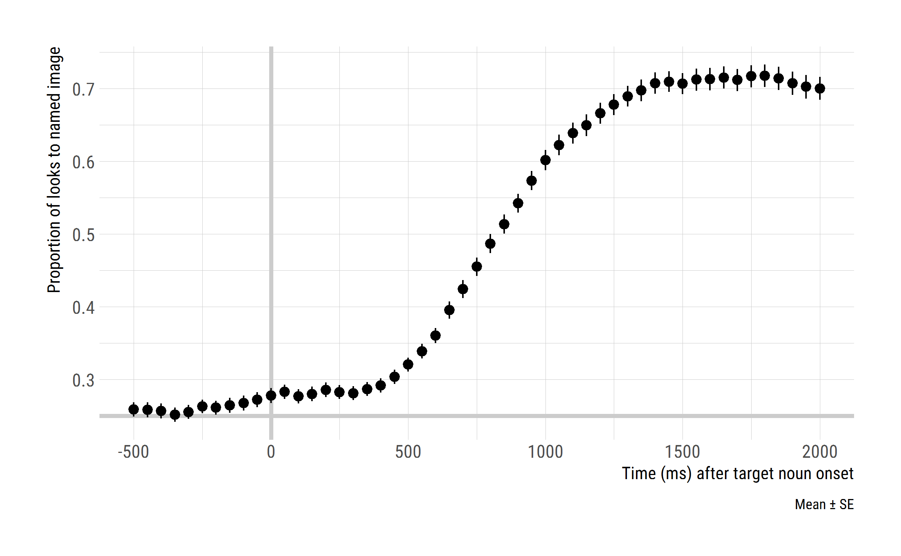
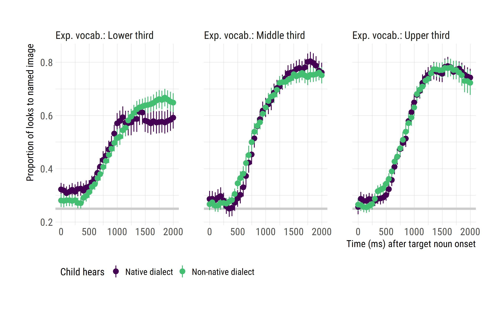
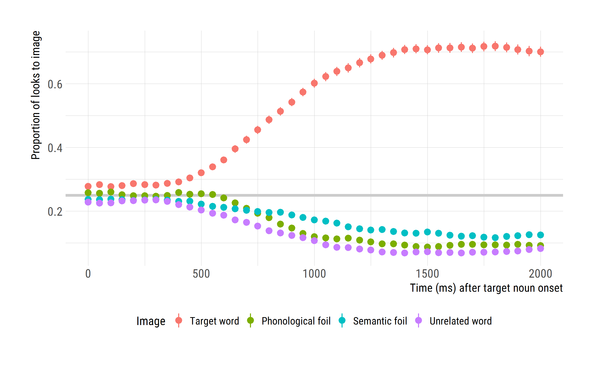
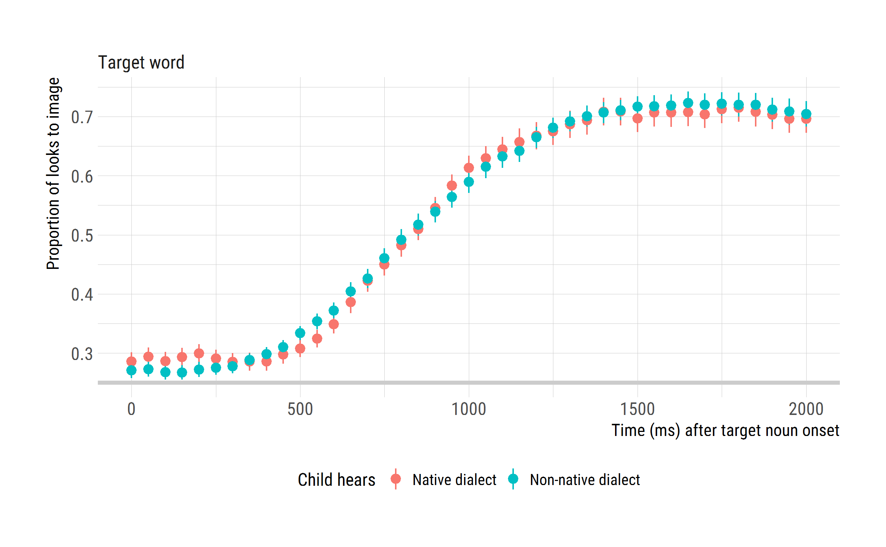
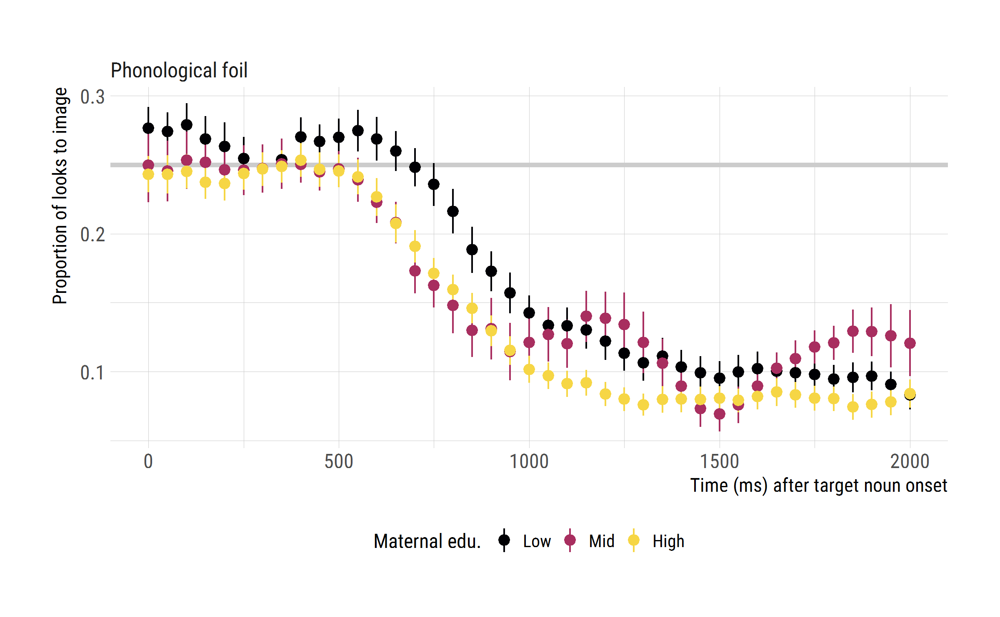
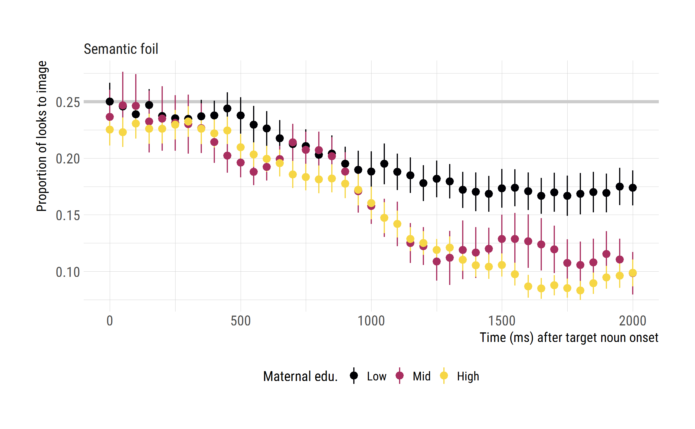
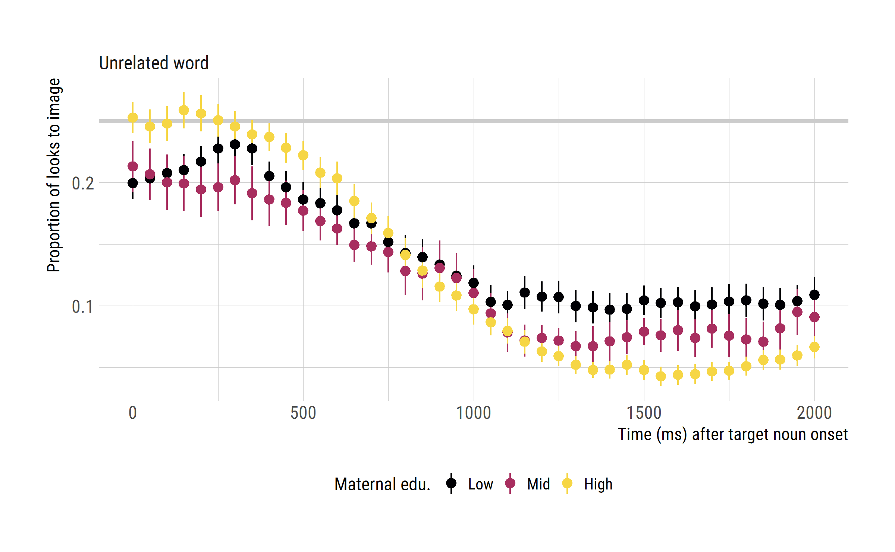
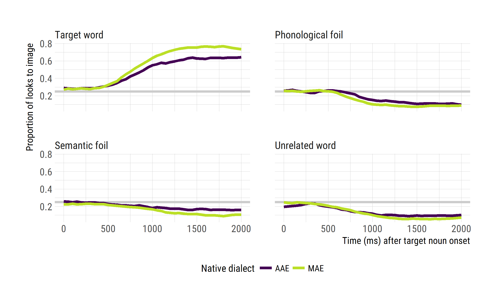
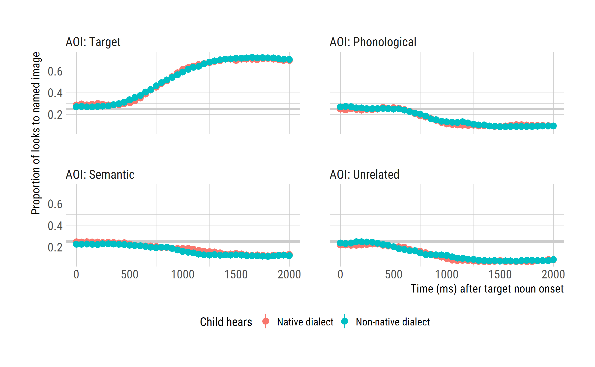
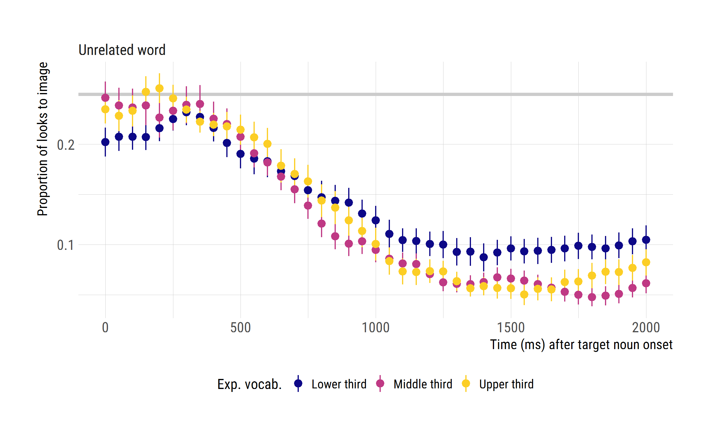

Comparison of word recognition performance in native versus unfamiliar dialects for preschool age children
================
Tristan Mahr
2017-05-11

Problem statement
-----------------

ME would like to look at the data for the RWL task for participants in the Dialect Switch study. I will

-   summarize child-level measurements for the participants in these studies
-   wrangle and reduce the eyetracking data
-   plot the main effect of dialect on familiar word recognition

Find the eyetracking blocks
---------------------------

Connect to database:

``` r
library(dplyr)
library(L2TDatabase)

# Work relative to RStudio project
wd <- rprojroot::find_rstudio_root_file()
dir_here <- file.path(wd, "inst", "analyses", "ci_matching")
cnf_file <- file.path(wd, "inst", "l2t_db.cnf")

# Connect to the individual databases
l2t_main <- l2t_connect(cnf_file, "l2t")
l2t_backend <- l2t_connect(cnf_file, "backend")
l2t_eyetracking <- l2t_connect(cnf_file, "eyetracking")
```

### Determine which blocks of RWL used which stimuli

JE says that we should only use the experiments that used the re-recorded stimuli for TimePoint2. We modified the stimuli at TimePoint2 so that the two dialect versions had similar durations.

These are the tables in the eyetracking database.

``` r
src_tbls(l2t_eyetracking)
#>  [1] "BlockAttributes"          "Blocks"                  
#>  [3] "Looks"                    "TrialAttributes"         
#>  [5] "Trials"                   "q_BlockAttributesByStudy"
#>  [7] "q_BlocksByStudy"          "q_LooksByStudy"          
#>  [9] "q_MissingDataByBlock"     "q_TrialAttributesByStudy"
#> [11] "q_TrialsByStudy"
```

Tables with `q_` at the front are queries which contain helpful information (like Study and ResearchID) alongside the main data in the table. We use the `q_TrialAttributesByStudy` table to get information about each eyetracking trial. I use `q_` for queries that developed in these scripts as well.

``` r
# Dialects used in each block
q_block_dialects <- l2t_eyetracking %>% 
  tbl("q_BlockAttributesByStudy") %>% 
  filter(Task == "RWL", 
    BlockAttribute_Name == c("Dialect"), 
    Study %in% c("DialectSwitch", "MaternalEd")) %>% 
  select(BlockID, Dialect = BlockAttribute_Value)

q_block_ages <- l2t_eyetracking %>% 
  tbl("Blocks") %>% 
  select(BlockID, Block_Age)

# Find the blocks that used TP2 stimuli.
q_blocks_to_use <- l2t_eyetracking %>% 
  tbl("q_BlockAttributesByStudy") %>% 
  filter(
    Task == "RWL", 
    BlockAttribute_Name == c("StimulusSet"), 
    BlockAttribute_Value == c("TP2"),
    Study %in% c("DialectSwitch", "MaternalEd")) %>% 
  select(-BlockAttribute_Name, StimulusSet = BlockAttribute_Value) %>% 
  left_join(q_block_dialects) %>% 
  left_join(q_block_ages)
```

Count the number of blocks in the dialect-varying studies.

``` r
q_blocks_to_use %>% 
  count(Study, Dialect, StimulusSet) %>% 
  rename(nBlocks = n) %>% 
  ungroup() %>% 
  collect()
#> # A tibble: 4 × 4
#>           Study Dialect StimulusSet nBlocks
#>           <chr>   <chr>       <chr>   <dbl>
#> 1 DialectSwitch     AAE         TP2      42
#> 2 DialectSwitch     SAE         TP2      41
#> 3    MaternalEd     AAE         TP2      20
#> 4    MaternalEd     SAE         TP2      19
```

Download block and child demographic information
------------------------------------------------

Download child-level information.

``` r
df_child_info <- tbl(l2t_backend, "Child") %>% 
  left_join(tbl(l2t_backend, "ChildStudy")) %>% 
  left_join(tbl(l2t_backend, "Study")) %>% 
  filter(Study %in% c("DialectSwitch", "MaternalEd")) %>% 
  rename(ResearchID = ShortResearchID) %>% 
  collect() %>% 
  left_join(collect(tbl(l2t_main, "Maternal_Education"))) %>% 
  select(Study, ResearchID, ChildID, ChildStudyID, 
         Female, AAE, LateTalker, CImplant, 
         Maternal_Education, Maternal_Education_Level) 

# Add some helper columns
df_medu_scheme <- data_frame(
  Maternal_Education_Level = c(NA, 1:7),
  Maternal_Education_Group = c(NA, "Low", "Low", "Low", "Mid", 
                               "Mid", "High", "High")
)

df_child_info <- df_child_info %>% 
  left_join(df_medu_scheme) %>%
  mutate(
    Dialect = ifelse(AAE, "AAE", "MAE"),
    Gender = ifelse(Female, "Girl", "Boy")) 

df_child_info$Maternal_Education_Group <- factor(
  df_child_info$Maternal_Education_Group, 
  levels = c("Low", "Mid", "High")
)
```

Attach research IDs and study names to the non-TP1 blocks.

``` r
df_rwl_blocks <- q_blocks_to_use %>% 
  rename(BlockDialect = Dialect) %>% 
  collect() %>% 
  left_join(df_child_info)
```

Now we count the number of dialects presented to each child to find out who received more than one version of the experiment.

``` r
df_children_who_got_multiple_dialects <- df_rwl_blocks %>% 
  select(ChildID, AAE, BlockDialect) %>% 
  distinct() %>% 
  # Count the dialects presented to each child. Find multiple dialect children
  count(AAE, ChildID) %>% 
  filter(n > 1) %>% 
  ungroup() %>% 
  select(ChildID)

df_blocks_to_keep <- df_rwl_blocks %>% 
  inner_join(df_children_who_got_multiple_dialects)
```

One child apparently got three blocks. Figure out which block to manually exclude.

``` r
q_blocks_to_use %>% 
  group_by(ResearchID) %>% 
  tally() %>% 
  collect() %>% 
  filter(n > 2)
#> # A tibble: 1 × 2
#>   ResearchID     n
#>        <chr> <dbl>
#> 1       436D     3

q_blocks_to_use %>% 
  collect() %>% 
  filter(ResearchID == "436D")
#> # A tibble: 3 × 10
#>   BlockID         Study ResearchID  Task  Version             Basename
#>     <int>         <chr>      <chr> <chr>    <chr>                <chr>
#> 1    1229 DialectSwitch       436D   RWL Standard RWL_Block1_436D53FA2
#> 2    1230 DialectSwitch       436D   RWL Standard RWL_Block1_436D53FS2
#> 3    1231 DialectSwitch       436D   RWL Standard RWL_Block2_436D53FA1
#> # ... with 4 more variables: DateTime <chr>, StimulusSet <chr>,
#> #   Dialect <chr>, Block_Age <int>

# Skip the latest redundant plock
df_blocks_to_keep <- df_blocks_to_keep %>% 
  filter(DateTime != "2014-04-01 09:52:14")

# Update the server-side query to use the restricted subset of blocks
q_blocks_to_use <- q_blocks_to_use %>% 
  filter(BlockID %in% df_blocks_to_keep$BlockID)
```

Download the gaze data
----------------------

Download the eyetracking data

``` r
# Keep just the trials in the blocks we want
q_rwl_trials <- tbl(l2t_eyetracking, "Trials") %>% 
  semi_join(q_blocks_to_use)

# Download the gazes in those trials
df_raw_rwl_looks <- tbl(l2t_eyetracking, "Looks") %>% 
  inner_join(q_rwl_trials) %>% 
  select(TrialID, Time, GazeByImageAOI) %>% 
  collect(n = Inf) 

df_rwl_looks <- df_raw_rwl_looks %>% 
  inner_join(collect(q_rwl_trials)) %>% 
  inner_join(df_blocks_to_keep) %>% 
  rename(TrialNo = Trial_TrialNo)


# rwl_looks <- rwl_looks %>% 
#   left_join(blocks_to_keep) %>% 
#   left_join(child_info) %>% 
#   select(Study, ResearchID, Dialect, BlockDialect, Block_Age,
#          BlockID, ChildID:Maternal_Education_Level, 
#          Maternal_Education_Group:PPVT_Standard,
#          TrialID, TrialNo, Time, GazeByImageAOI)
# 
# # rwl_looks %>% filter(is.na(Dialect))
# 
# rwl_looks <- rwl_looks %>% 
```

Data screening
--------------

Excessive missing data is defined as having more than 50% missing data between 0 and 2000 ms (relative to target onset).

Filter out participants who have an *entire block* with excessive missing data averaged across trials.

``` r
library(lookr)
library(ggplot2)

df_participants_to_drop <- df_rwl_looks %>% 
  filter(between(Time, -20, 2020)) %>% 
  AggregateLooks(Dialect + BlockID + ResearchID ~ GazeByImageAOI) %>%
  tibble::as_tibble() %>% 
  filter(PropNA > .5) %>% 
  select(NativeDialect = Dialect, ResearchID) %>% 
  print()
#> # A tibble: 5 × 2
#>   NativeDialect ResearchID
#>           <chr>      <chr>
#> 1           AAE       514M
#> 2           MAE       425D
#> 3           MAE       451D
#> 4           MAE       454D
#> 5           MAE       455D
```

5 participants are dropped for excessive missing data.

Filter out individual trials with excessive missing data.

``` r
df_trials_to_drop  <- df_rwl_looks %>% 
  anti_join(df_participants_to_drop) %>% 
  filter(between(Time, -20, 2020)) %>% 
  AggregateLooks(Dialect + TrialID + ResearchID ~ GazeByImageAOI) %>% 
  tibble::as_tibble() %>% 
  filter(PropNA > .5) %>% 
  select(NativeDialect = Dialect, ResearchID, TrialID)

df_trials_to_drop %>% 
  count(NativeDialect)
#> # A tibble: 2 × 2
#>   NativeDialect     n
#>           <chr> <int>
#> 1           AAE    92
#> 2           MAE   143
```

235 additional trials are dropped.

Data quality stats for remaining children.

``` r
df_rwl_looks <- df_rwl_looks %>% 
  anti_join(df_participants_to_drop) %>% 
  anti_join(df_trials_to_drop) %>% 
  mutate(BlockDialect = ifelse(BlockDialect == "AAE", "AAE", "MAE"),
         HearsNativeDialect = Dialect == BlockDialect)

df_rwl_looks %>%
  filter(between(Time, -20, 2020)) %>% 
  AggregateLooks(Dialect + BlockDialect + ResearchID + TrialID ~ GazeByImageAOI) %>% 
  tibble::as_tibble() %>% 
  group_by(Dialect, BlockDialect, ResearchID) %>% 
  summarise(
    nGoodTrials = n(),
    Mean_Prop_NA = mean(PropNA)) %>% 
  summarise(
    nChildren = n(), 
    `Total Useable Trials` = sum(nGoodTrials),
    `Mean N of Useable Trials` = mean(nGoodTrials) %>% round(1), 
    `SD Trials` = sd(nGoodTrials) %>% round(1),
    `Min Trials` = min(nGoodTrials),
    `Max Trials` = max(nGoodTrials),
    `Mean Prop of Missing Data` = mean(Mean_Prop_NA) %>% round(3), 
    `SD Prop Missing` = sd(Mean_Prop_NA) %>% round(3),
    `Min Prop Missing` = min(Mean_Prop_NA) %>% round(3),
    `Max Prop Missing` = max(Mean_Prop_NA) %>% round(3)) %>% 
  knitr::kable()
```

| Dialect | BlockDialect |  nChildren|  Total Useable Trials|  Mean N of Useable Trials|  SD Trials|  Min Trials|  Max Trials|  Mean Prop of Missing Data|  SD Prop Missing|  Min Prop Missing|  Max Prop Missing|
|:--------|:-------------|----------:|---------------------:|-------------------------:|----------:|-----------:|-----------:|--------------------------:|----------------:|-----------------:|-----------------:|
| AAE     | AAE          |         20|                   437|                      21.9|        2.5|          15|          24|                      0.077|            0.047|             0.016|             0.190|
| AAE     | MAE          |         20|                   431|                      21.6|        2.1|          16|          24|                      0.079|            0.046|             0.024|             0.175|
| MAE     | AAE          |         33|                   727|                      22.0|        3.1|          12|          24|                      0.080|            0.058|             0.002|             0.229|
| MAE     | MAE          |         33|                   714|                      21.6|        2.7|          15|          24|                      0.075|            0.043|             0.011|             0.200|

``` r

df_participants <- df_rwl_looks %>% 
  distinct(Study, ResearchID, ChildStudyID)

df_child_info <- df_child_info %>% inner_join(df_participants)
```

Summarize child-level information
---------------------------------

Now that we know which blocks to include, we can get the vocabulary scores for the children who contributed those blocks.

``` r
df_evt <- tbl(l2t_main, "EVT") %>% 
  select(Study, ResearchID, EVT_Age:EVT_Standard) %>% 
  collect()

df_ppvt <- tbl(l2t_main, "PPVT") %>% 
  select(Study, ResearchID, PPVT_Age:PPVT_Standard) %>% 
  collect()

df_child_vars <- df_child_info %>% 
  select(Study, ResearchID, ChildStudyID, Female:Gender) %>% 
  distinct() %>% 
  left_join(df_evt) %>% 
  left_join(df_ppvt)
```

Boys/girls by native dialect.

``` r
df_child_vars %>% 
  count(Dialect, Gender) %>% 
  ungroup() %>% 
  rename(`N Children` = n) %>% 
  knitr::kable()
```

| Dialect | Gender |  N Children|
|:--------|:-------|-----------:|
| AAE     | Boy    |           7|
| AAE     | Girl   |          13|
| MAE     | Boy    |          18|
| MAE     | Girl   |          15|

Maternal education by native dialect.

``` r
df_child_vars %>% 
  count(Dialect, Maternal_Education_Group) %>% 
  ungroup() %>% 
  rename(`N Children` = n) %>%   
  knitr::kable() 
```

| Dialect | Maternal\_Education\_Group |  N Children|
|:--------|:---------------------------|-----------:|
| AAE     | Low                        |          16|
| AAE     | Mid                        |           2|
| AAE     | High                       |           1|
| AAE     | NA                         |           1|
| MAE     | Low                        |           2|
| MAE     | Mid                        |           6|
| MAE     | High                       |          24|
| MAE     | NA                         |           1|

``` r

df_child_vars %>% 
  count(Dialect, Maternal_Education_Group) %>% 
  ungroup() %>% 
  tidyr::spread(Dialect, n) %>% 
  knitr::kable()
```

| Maternal\_Education\_Group |  AAE|  MAE|
|:---------------------------|----:|----:|
| Low                        |   16|    2|
| Mid                        |    2|    6|
| High                       |    1|   24|
| NA                         |    1|    1|

``` r

df_child_vars %>% 
  count(Dialect, Maternal_Education_Group, Maternal_Education) %>% 
  ungroup() %>% 
  tidyr::spread(Dialect, n) %>% 
  tidyr::replace_na(list(AAE = 0, MAE = 0)) %>% 
  knitr::kable()
```

| Maternal\_Education\_Group | Maternal\_Education          |  AAE|  MAE|
|:---------------------------|:-----------------------------|----:|----:|
| Low                        | GED                          |    1|    0|
| Low                        | High School Diploma          |    6|    2|
| Low                        | Less Than High School        |    9|    0|
| Mid                        | Some College (&lt;2 years)   |    0|    1|
| Mid                        | Some College (2+ years)      |    0|    3|
| Mid                        | Technical/Associate's Degree |    2|    2|
| High                       | College Degree               |    1|   12|
| High                       | Graduate Degree              |    0|   12|
| NA                         | NA                           |    1|    1|

Child level measures by dialect group.

``` r
narm_mean <- function(...) mean(..., na.rm = TRUE)
narm_sd <- function(...) sd(..., na.rm = TRUE)
narm_n <- function(...) sum(!is.na(...))

df_child_vars %>% 
  group_by(Dialect) %>% 
  summarise(
    `N Children` = n(), 
    sum(Female),
    `Mean Age (months)` = narm_mean(EVT_Age),
    `SD Age (months)` = narm_sd(EVT_Age),
    `N EVT` = narm_n(EVT_Raw), 
    `Mean EVT Standard` = narm_mean(EVT_Standard),
    `SD EVT Standard` = narm_sd(EVT_Standard),
    `N PPVT` = narm_n(PPVT_Raw), 
    `Mean PPVT Standard` = narm_mean(PPVT_Standard),
    `SD PPVT Standard` = narm_sd(PPVT_Standard)) %>% 
  knitr::kable(digits = 1)
```

| Dialect |  N Children|  sum(Female)|  Mean Age (months)|  SD Age (months)|  N EVT|  Mean EVT Standard|  SD EVT Standard|  N PPVT|  Mean PPVT Standard|  SD PPVT Standard|
|:--------|-----------:|------------:|------------------:|----------------:|------:|------------------:|----------------:|-------:|-------------------:|-----------------:|
| AAE     |          20|           13|               47.8|              8.1|     20|               95.9|             11.6|      20|                95.9|              10.2|
| MAE     |          33|           15|               50.9|              5.9|     32|              119.8|             14.7|      33|               120.5|              17.8|

``` r

df_child_vars %>% 
  group_by(Dialect, Maternal_Education_Group) %>% 
  summarise(
    `N Children` = n(), 
    `Mean Age (months)` = narm_mean(EVT_Age),
    `SD Age (months)` = narm_sd(EVT_Age),
    `N EVT` = narm_n(EVT_Raw), 
    `Mean EVT Standard` = narm_mean(EVT_Standard),
    `SD EVT Standard` = narm_sd(EVT_Standard),
    `N PPVT` = narm_n(PPVT_Raw), 
    `Mean PPVT Standard` = narm_mean(PPVT_Standard),
    `SD PPVT Standard` = narm_sd(PPVT_Standard)) %>% 
  knitr::kable(digits = 1)
```

| Dialect | Maternal\_Education\_Group |  N Children|  Mean Age (months)|  SD Age (months)|  N EVT|  Mean EVT Standard|  SD EVT Standard|  N PPVT|  Mean PPVT Standard|  SD PPVT Standard|
|:--------|:---------------------------|-----------:|------------------:|----------------:|------:|------------------:|----------------:|-------:|-------------------:|-----------------:|
| AAE     | Low                        |          16|               47.1|              7.1|     16|               95.8|             13.0|      16|                96.1|              11.1|
| AAE     | Mid                        |           2|               52.0|             17.0|      2|               98.5|              2.1|       2|                91.0|               2.8|
| AAE     | High                       |           1|               58.0|               NA|      1|               93.0|               NA|       1|               103.0|                NA|
| AAE     | NA                         |           1|               40.0|               NA|      1|               95.0|               NA|       1|                96.0|                NA|
| MAE     | Low                        |           2|               48.0|              1.4|      2|              109.0|             11.3|       2|               110.0|               1.4|
| MAE     | Mid                        |           6|               54.0|              6.8|      5|              119.0|             14.3|       6|               113.5|              32.4|
| MAE     | High                       |          24|               50.3|              5.9|     24|              121.6|             15.0|      24|               123.0|              13.5|
| MAE     | NA                         |           1|               56.0|               NA|      1|              103.0|               NA|       1|               123.0|                NA|

Finally, plots of fixation patterns over time
---------------------------------------------

Assign the individual frames into 50-ms bins.

``` r
df_bin_times <- df_rwl_looks %>%  
  filter(between(Time, -520, 2020)) %>% 
  distinct(Time) %>% 
  mutate(Bin = lookr::AssignBins(Time, bin_width = 3)) %>% 
  group_by(Bin) %>% 
  mutate(BinTime = Time %>% median() %>% round(-1)) %>% 
  ungroup()
df_bin_times
#> # A tibble: 153 × 3
#>        Time   Bin BinTime
#>       <dbl> <int>   <dbl>
#> 1  -516.293     1    -500
#> 2  -499.638     1    -500
#> 3  -482.983     1    -500
#> 4  -466.329     2    -450
#> 5  -449.674     2    -450
#> 6  -433.020     2    -450
#> 7  -416.365     3    -400
#> 8  -399.710     3    -400
#> 9  -383.056     3    -400
#> 10 -366.401     4    -350
#> # ... with 143 more rows
```

Aggregated looking data over Time across trials within Dialect x BlockDialect within Child.

``` r
df_looks <- df_rwl_looks %>%
  inner_join(df_bin_times) %>% 
  AggregateLooks(Maternal_Education_Group + Study + Dialect + BlockDialect + 
                   HearsNativeDialect + ResearchID + BinTime ~ GazeByImageAOI) %>% 
  tibble::as_tibble() %>% 
  rename(Time = BinTime) %>% 
  mutate(Looks_Images = Target + Others,
       Prop_Target = Target / Looks_Images,
       Prop_PhonologicalFoil = PhonologicalFoil / Looks_Images,
       Prop_SemanticFoil = SemanticFoil / Looks_Images,
       Prop_Unrelated = Unrelated / Looks_Images)

df_evt <- df_child_vars %>% 
  mutate(Vocab3tile = ntile(EVT_Standard, 3), 
         `Exp. vocab.` = factor(Vocab3tile, 1:3, 
                                c("Lower third", "Middle third", "Upper third"))) %>% 
  select(Study, ResearchID, Vocab3tile, `Exp. vocab.`)

df_looks <- df_looks %>% 
  mutate(`Child hears` = ifelse(HearsNativeDialect, "Native dialect", 
                                "Non-native dialect"),
         `Native dialect` = Dialect,
         `Maternal edu.` = Maternal_Education_Group) %>% 
  left_join(df_evt)
```

``` r
library(hrbrthemes)
plot_text <- list(
  x_time = "Time (ms) after target noun onset", 
  y_target = "Proportion of looks to named image",
  y_image = "Proportion of looks to image",
  caption_mean_se = "Mean ± SE"
)

legend_position <- theme(
  legend.position = "bottom", 
  legend.text = element_text(size = 10), 
  legend.justification = "left")

colors <- viridis::scale_color_viridis(end = .7, discrete = TRUE)

ggplot(df_looks) + 
  aes(x = Time, y = Proportion) +   
  geom_hline(yintercept = .25, size = 1.25, color = "#cccccc") + 
  geom_vline(xintercept = 0, size = 1.25, color = "#cccccc") + 
  stat_summary() + 
  theme_ipsum_rc(axis_title_size = 11) + 
  labs(x = plot_text$x_time, 
       y = plot_text$y_target, 
       caption = plot_text$caption_mean_se)
```



``` r

ggplot(df_looks) + 
  aes(x = Time, y = Proportion, color = `Child hears`) + 
  geom_hline(yintercept = .25, size = 1.25, color = "#cccccc") + 
  geom_vline(xintercept = 0, size = 1.25, color = "#cccccc") + 
  stat_summary() + 
  theme_ipsum_rc(axis_title_size = 11) + 
  legend_position + 
  labs(x = plot_text$x_time, 
       y = plot_text$y_target) + 
  colors
```


``` r

ggplot(df_looks) + 
  aes(x = Time, y = Proportion, color = `Child hears`) + 
  geom_hline(yintercept = .25, size = 1.25, color = "#cccccc") + 
  stat_summary() + 
  theme_ipsum_rc(axis_title_size = 11) + 
  legend_position + 
  labs(x = plot_text$x_time, 
       y = plot_text$y_target) +
  facet_wrap("`Native dialect`", labeller = label_both) + 
  xlim(0, 2000) + 
  colors
```


``` r

ggplot(df_looks %>% filter(!is.na(`Exp. vocab.`))) + 
  aes(x = Time, y = Proportion, color = `Child hears`) + 
  geom_hline(yintercept = .25, size = 1.25, color = "#cccccc") + 
  stat_summary() + 
  theme_ipsum_rc(axis_title_size = 11) + 
  legend_position + 
  colors +
  labs(x = plot_text$x_time, 
       y = plot_text$y_target) +
  facet_wrap("`Exp. vocab.`", labeller = label_both) + 
  xlim(0, 2000)
```



``` r

ggplot(df_looks %>% filter(!is.na(Maternal_Education_Group))) + 
  aes(x = Time, y = Proportion, color = `Child hears`) + 
  geom_hline(yintercept = .25, size = 1.25, color = "#cccccc") + 
  stat_summary() + 
  theme_ipsum_rc(axis_title_size = 11) + 
  theme(legend.position = "bottom", legend.text = element_text(size = 10)) + 
  labs(x = plot_text$x_time, 
       y = plot_text$y_target) +
  facet_wrap("`Maternal edu.`", labeller = label_both) + 
  xlim(0, 2000)
```


Plot looks to each competitor type.
-----------------------------------

``` r
df_looks_to_aois <- df_looks %>% 
  select(Study, ResearchID, `Child hears`:`Maternal edu.`, `Exp. vocab.`,
         Time, starts_with("Prop_")) %>% 
  tidyr::gather(AOI, Proportion, starts_with("Prop_")) %>% 
  mutate(AOI = AOI %>% 
           stringr::str_replace("Prop_", "") %>% 
           stringr::str_replace("Foil", "")) 

df_looks_to_aois$AOI <- factor(
  df_looks_to_aois$AOI, 
  levels = c("Target", "Phonological", "Semantic", "Unrelated"))

df_looks_to_aois$Image <- factor(
  df_looks_to_aois$AOI, 
  labels = c("Target word", "Phonological foil", "Semantic foil", "Unrelated word"),
  levels = c("Target", "Phonological", "Semantic", "Unrelated"))


ggplot(df_looks_to_aois) + 
  aes(x = Time, y = Proportion, color = Image) + 
  geom_hline(yintercept = .25, size = 1.25, color = "#cccccc") + 
  stat_summary() + 
  theme_ipsum_rc(axis_title_size = 11) + 
  theme(legend.position = "bottom", legend.text = element_text(size = 10)) + 
  labs(x = plot_text$x_time, 
       y = plot_text$y_image) + 
  xlim(0, 2000)
```



``` r

ggplot(df_looks_to_aois) + 
  aes(x = Time, y = Proportion, color = Image) + 
  geom_hline(yintercept = .25, size = 1.25, color = "#cccccc") + 
  stat_summary() + 
  facet_wrap("`Child hears`", labeller = label_both) + 
  theme_ipsum_rc(axis_title_size = 11) + 
  theme(legend.position = "bottom", legend.text = element_text(size = 10)) + 
  labs(x = plot_text$x_time, 
       y = plot_text$y_image) + 
  xlim(0, 2000)
```


By AOI

``` r
ggplot(df_looks_to_aois %>% filter(Image == "Phonological foil")) + 
  aes(x = Time, y = Proportion, color = `Child hears`) + 
  geom_hline(yintercept = .25, size = 1.25, color = "#cccccc") + 
  stat_summary() + 
  facet_wrap("Image") + 
  theme_ipsum_rc(axis_title_size = 11) + 
  theme(legend.position = "bottom", legend.text = element_text(size = 10)) + 
  labs(x = plot_text$x_time, 
       y = plot_text$y_image) + 
  xlim(0, 2000)
```


``` r

# Use %+% to replace the data-set used in a plot
last_plot() %+% 
  filter(df_looks_to_aois, Image == "Semantic foil")
```


``` r

last_plot() %+% 
  filter(df_looks_to_aois, Image == "Unrelated word")
```


``` r

last_plot() %+% 
  filter(df_looks_to_aois, Image == "Target word")
```



AOI by maternal edu

``` r
ggplot(df_looks_to_aois %>% 
         filter(Image == "Phonological foil", !is.na(`Maternal edu.`))) + 
  aes(x = Time, y = Proportion, color = `Maternal edu.`) + 
  geom_hline(yintercept = .25, size = 1.25, color = "#cccccc") + 
  stat_summary() + 
  facet_wrap("Image") + 
  theme_ipsum_rc(axis_title_size = 11) + 
  viridis::scale_color_viridis(discrete = TRUE, option = "inferno", end = .9) +
  theme(legend.position = "bottom", legend.text = element_text(size = 10)) + 
  labs(x = plot_text$x_time, 
       y = plot_text$y_image) + 
  xlim(0, 2000)
```



``` r

last_plot() %+% 
  filter(df_looks_to_aois, 
         Image == "Semantic foil", !is.na(`Maternal edu.`))
```



``` r

last_plot() %+% 
  filter(df_looks_to_aois, 
         Image == "Unrelated word", !is.na(`Maternal edu.`))
```



``` r

last_plot() %+% 
  filter(df_looks_to_aois, 
         Image == "Target word", !is.na(`Maternal edu.`))
```


``` r


ggplot(df_looks_to_aois %>% filter(!is.na(`Maternal edu.`))) + 
  aes(x = Time, y = Proportion, color = `Maternal edu.`) + 
  geom_hline(yintercept = .25, size = 1.25, color = "#cccccc") + 
  stat_summary(fun.y = "mean", geom = "line", size = 1.5) + 
  viridis::scale_color_viridis(discrete = TRUE, option = "inferno", end = .9) +
  facet_wrap("Image") + 
  theme_ipsum_rc(axis_title_size = 11) + 
  theme(legend.position = "bottom", legend.text = element_text(size = 10)) + 
  labs(x = plot_text$x_time, 
       y = plot_text$y_image) + 
  xlim(0, 2000)
```


``` r


ggplot(df_looks_to_aois) + 
  aes(x = Time, y = Proportion, color = `Native dialect`) + 
  geom_hline(yintercept = .25, size = 1.25, color = "#cccccc") + 
  stat_summary(fun.y = "mean", geom = "line", size = 1.5) + 
  viridis::scale_color_viridis(discrete = TRUE, option = "viridis", end = .9) +
  facet_wrap("Image") + 
  theme_ipsum_rc(axis_title_size = 11) + 
  theme(legend.position = "bottom", legend.text = element_text(size = 10)) + 
  labs(x = plot_text$x_time, 
       y = plot_text$y_image) + 
  xlim(0, 2000)
```



``` r

ggplot(df_looks_to_aois) + 
  aes(x = Time, y = Proportion, color = `Child hears`) + 
  geom_hline(yintercept = .25, size = 1.25, color = "#cccccc") + 
  stat_summary() + 
  facet_wrap("AOI", labeller = label_both) + 
  theme_ipsum_rc(axis_title_size = 11) + 
  theme(legend.position = "bottom", legend.text = element_text(size = 10)) + 
  labs(x = plot_text$x_time, 
       y = plot_text$y_target) + 
  xlim(0, 2000)
```



By vocabulary.

``` r
ggplot(df_looks_to_aois %>% 
         filter(Image == "Phonological foil", !is.na(`Exp. vocab.`))) + 
  aes(x = Time, y = Proportion, color = `Exp. vocab.`) + 
  geom_hline(yintercept = .25, size = 1.25, color = "#cccccc") + 
  stat_summary() + 
  facet_wrap("Image") + 
  theme_ipsum_rc(axis_title_size = 11) + 
  viridis::scale_color_viridis(discrete = TRUE, option = "plasma", end = .9) +
  theme(legend.position = "bottom", legend.text = element_text(size = 10)) + 
  labs(x = plot_text$x_time, 
       y = plot_text$y_image) + 
  xlim(0, 2000)
```


``` r

last_plot() %+% 
  filter(df_looks_to_aois, 
         Image == "Semantic foil", !is.na(`Exp. vocab.`))
```


``` r

last_plot() %+% 
  filter(df_looks_to_aois, 
         Image == "Unrelated word", !is.na(`Exp. vocab.`))
```



``` r

last_plot() %+% 
  filter(df_looks_to_aois, 
         Image == "Target word", !is.na(`Exp. vocab.`)) 
```


