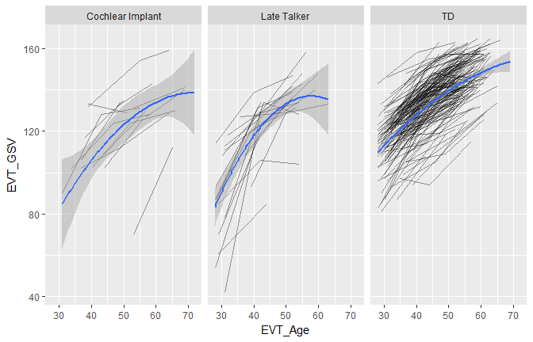

Expressive Vocabulary Growth
================
Tristan Mahr
February 11, 2016

``` r
library("L2TDatabase")
library("dplyr")
#> Warning: package 'dplyr' was built under R version 3.4.1
#> 
#> Attaching package: 'dplyr'
#> The following objects are masked from 'package:stats':
#> 
#>     filter, lag
#> The following objects are masked from 'package:base':
#> 
#>     intersect, setdiff, setequal, union

# Connect to dat-base
cnf_file <- file.path(getwd(), "inst/l2t_db.cnf")
l2t <- l2t_connect(cnf_file, "backend")

# Combine EVT and Child tables to get LateTalker/Implant status
evts <- tbl(l2t, "EVT") %>% 
  left_join("ChildStudy" %from% l2t) %>% 
  left_join("Child" %from% l2t)
#> Joining, by = "ChildStudyID"
#> Joining, by = "ChildID"

# Ready data-frame
d <- evts %>% 
  collect() %>% 
  filter(!is.na(EVT_GSV)) %>% 
  select(ChildID, EVT_Age, EVT_GSV, LateTalker, CImplant) %>% 
  mutate(Group = ifelse(LateTalker, "Late Talker", "TD"),
         Group = ifelse(CImplant, "Cochlear Implant", Group))

d %>% count()
#> # A tibble: 1 x 1
#>       n
#>   <int>
#> 1   661
d %>% count(Group)
#> # A tibble: 3 x 2
#>              Group     n
#>              <chr> <int>
#> 1 Cochlear Implant    46
#> 2      Late Talker    64
#> 3               TD   551

# Plot quadratic growth curve
library("ggplot2")
ggplot(d) + 
  aes(x = EVT_Age, y = EVT_GSV) + 
  geom_line(aes(group = ChildID), alpha = .4) + 
  facet_grid(~ Group) + 
  stat_smooth(method = "lm", formula = y ~ poly(x, 2))
```


