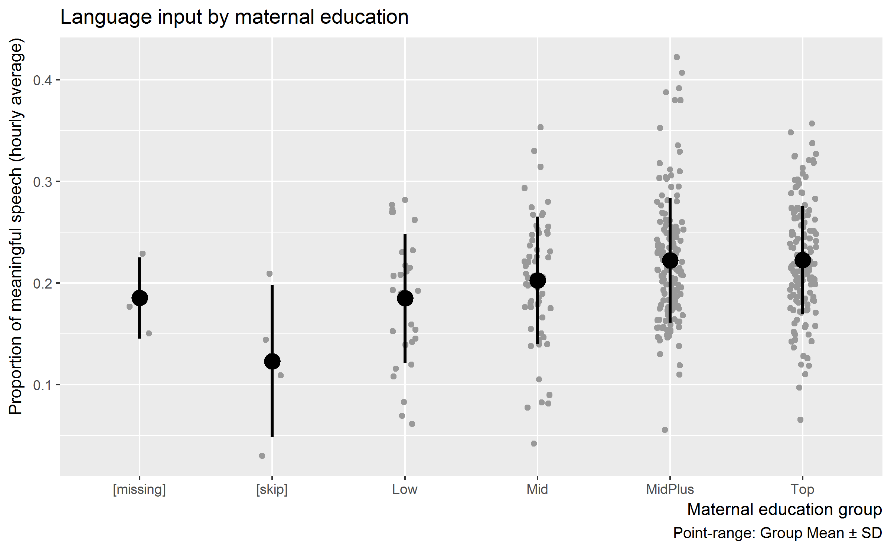
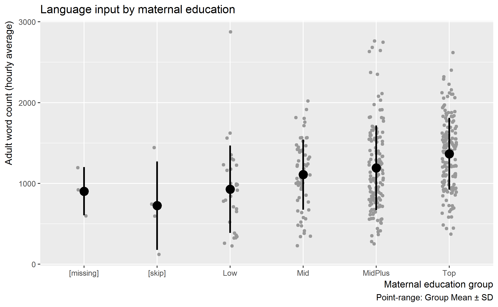

How does language input vary with maternal education level
================
Tristan Mahr
2017-03-01

JRE asks whether we should put the "less than two years of college" maternal education households with the "high school or less" households or with the "some college" and "technical/associate's degree" households. We are going to look at how the LENA measurements vary with maternal education level.

Data munging
------------

Connect to database.

``` r
library(dplyr)
library(L2TDatabase)

# Work relative to RStudio project
wd <- rprojroot::find_rstudio_root_file()
dir_here <- file.path(wd, "inst", "analyses", "ci_matching")
cnf_file <- file.path(wd, "inst", "l2t_db.cnf")

l2t_main <- l2t_connect(cnf_file, "l2t")
```

Get the maternal education codes from the database.

``` r
medu_scales <- tbl(l2t_main, "Maternal_Education") %>% 
  distinct(Maternal_Education, Maternal_Education_Level) %>% 
  collect() %>% 
  arrange(Maternal_Education_Level)

knitr::kable(medu_scales)
```

| Maternal\_Education          |  Maternal\_Education\_Level|
|:-----------------------------|---------------------------:|
| Less Than High School        |                           1|
| GED                          |                           2|
| High School Diploma          |                           3|
| Some College (&lt;2 years)   |                           4|
| Some College (2+ years)      |                           5|
| Technical/Associate's Degree |                           5|
| Trade School                 |                           5|
| College Degree               |                           6|
| Graduate Degree              |                           7|
| NA                           |                          NA|

Simplify to a low-mid-mid-high scale.

``` r
medu_groups <- tibble::tribble(
  ~ Maternal_Education_Level, ~ Maternal_Education_Group,
  1, "Low", 
  2, "Low", 
  3, "Low", 
  4, "[skip]", 
  # Kind of awkward names but alphabetical order matches original order
  5, "Mid", 
  6, "MidPlus", 
  7, "Top", 
  NA, "[missing]")

medu_scales <- medu_scales %>% 
  left_join(medu_groups, by = "Maternal_Education_Level")

knitr::kable(medu_scales)
```

| Maternal\_Education          |  Maternal\_Education\_Level| Maternal\_Education\_Group |
|:-----------------------------|---------------------------:|:---------------------------|
| Less Than High School        |                           1| Low                        |
| GED                          |                           2| Low                        |
| High School Diploma          |                           3| Low                        |
| Some College (&lt;2 years)   |                           4| \[skip\]                   |
| Some College (2+ years)      |                           5| Mid                        |
| Technical/Associate's Degree |                           5| Mid                        |
| Trade School                 |                           5| Mid                        |
| College Degree               |                           6| MidPlus                    |
| Graduate Degree              |                           7| Top                        |
| NA                           |                          NA| \[missing\]                |

Combine LENA data with the maternal education codes.

``` r
medu <- tbl(l2t_main, "Maternal_Education") %>% 
  select(Study, ResearchID, HouseholdID, 
         Maternal_Education, Maternal_Education_Level) %>% 
  collect()
  
# These LENAs may or may not have problems based on the LENA notes, so let's
# ignore them for this analysis
lenas_to_exclude <- tibble::tribble(
  ~ Study, ~ ResearchID,
  "TimePoint1", "053L",
  "TimePoint1", "102L",
  "TimePoint1", "116L"
)

lena <- tbl(l2t_main, "LENA_Averages") %>% 
  select(Study, ResearchID, 
         LENA_Age, LENA_Hours, 
         LENA_Prop_Meaningful, LENA_AWC_Hourly) %>% 
  collect() %>% 
  anti_join(lenas_to_exclude, by = c("Study", "ResearchID"))

# Combine the tables
medu_lena <- lena %>% 
  left_join(medu, by = c("Study", "ResearchID")) %>% 
  left_join(medu_scales, 
            by = c("Maternal_Education", "Maternal_Education_Level"))
medu_lena
#> # A tibble: 398 × 10
#>         Study ResearchID LENA_Age LENA_Hours LENA_Prop_Meaningful
#>         <chr>      <chr>    <int>      <dbl>                <dbl>
#> 1  TimePoint1       035L       40     9.0267               0.2090
#> 2  TimePoint1       034L       39    13.2353               0.1762
#> 3  TimePoint1       033L       36    16.0000               0.1747
#> 4  TimePoint1       032L       38    16.0000               0.2514
#> 5  TimePoint1       031L       36    13.4461               0.2034
#> 6  TimePoint1       030L       39    15.3394               0.2075
#> 7  TimePoint1       029L       34    15.6650               0.1827
#> 8  TimePoint1       044L       32    15.2678               0.2622
#> 9  TimePoint1       043L       41    16.0000               0.2637
#> 10 TimePoint1       042L       31    16.0000               0.2655
#> # ... with 388 more rows, and 5 more variables: LENA_AWC_Hourly <dbl>,
#> #   HouseholdID <int>, Maternal_Education <chr>,
#> #   Maternal_Education_Level <dbl>, Maternal_Education_Group <chr>
```

How much LENA data we have in the different groups

``` r
# Households with LENA recordings
medu_lena %>% 
  group_by(Maternal_Education_Group) %>% 
  summarise(nRecordings = n(), 
            nChildren = n_distinct(ResearchID),
            nHouseholds = n_distinct(HouseholdID)) %>% 
  knitr::kable()
```

| Maternal\_Education\_Group |  nRecordings|  nChildren|  nHouseholds|
|:---------------------------|------------:|----------:|------------:|
| \[missing\]                |            3|          3|            3|
| \[skip\]                   |            4|          4|            4|
| Low                        |           30|         24|           22|
| Mid                        |           60|         38|           34|
| MidPlus                    |          147|         97|           78|
| Top                        |          154|         93|           87|

``` r

medu_lena %>% 
  group_by(Maternal_Education_Group) %>% 
  summarise(nRecordings = n(), 
            AWC_Mean = mean(LENA_AWC_Hourly) %>% round(),
            AWC_SD = sd(LENA_AWC_Hourly) %>% round(),
            Prop_Mean = mean(LENA_Prop_Meaningful),
            Prop_SD = sd(LENA_Prop_Meaningful)) %>% 
  knitr::kable(digits = 4)
```

| Maternal\_Education\_Group |  nRecordings|  AWC\_Mean|  AWC\_SD|  Prop\_Mean|  Prop\_SD|
|:---------------------------|------------:|----------:|--------:|-----------:|---------:|
| \[missing\]                |            3|        903|      299|      0.1853|    0.0399|
| \[skip\]                   |            4|        725|      547|      0.1231|    0.0747|
| Low                        |           30|        927|      541|      0.1850|    0.0633|
| Mid                        |           60|       1109|      434|      0.2025|    0.0630|
| MidPlus                    |          147|       1192|      524|      0.2223|    0.0613|
| Top                        |          154|       1367|      445|      0.2225|    0.0530|

Density of outcome measures
---------------------------

Visualize the data by group

``` r
library(ggplot2)

right_aligned <- theme(
  axis.title.x = element_text(hjust = 1), 
  axis.title.y = element_text(hjust = 1))

density_y_axis <-   theme(
  axis.text.y = element_blank(), 
  axis.ticks.y = element_blank())

df_plotting <- medu_lena %>% 
  filter(Maternal_Education_Group != "[skip]", 
         Maternal_Education_Group != "[missing]")

df_less_than_two <- medu_lena %>% 
  filter(Maternal_Education_Group == "[skip]")


ggplot(df_plotting) + 
  aes(x = LENA_Prop_Meaningful) + 
  geom_density(aes(color = Maternal_Education_Group)) + 
  geom_rug(data = df_less_than_two, size = 1) +
  xlim(0, .5) +
  labs(x = "Proportion of meaningful speech (hourly average)",
       y = "Density",
       color = NULL,
       title = "Language input by maternal education",
       caption = "Rug marks: Households with <2 years of college") +
  right_aligned + 
  density_y_axis
```


``` r


ggplot(df_plotting) + 
  aes(x = LENA_AWC_Hourly) + 
  geom_density(aes(color = Maternal_Education_Group)) + 
  geom_rug(data = df_less_than_two, size = 1) +
  labs(x = "Adult word count (hourly average)",
       y = "Density",
       color = NULL,
       title = "Language input by maternal education",
       caption = "Rug marks: Households with <2 years of college") +
  right_aligned + 
  density_y_axis
```


Means by group
--------------

``` r
ggplot(medu_lena) + 
  aes(x = Maternal_Education_Group, y = LENA_Prop_Meaningful) + 
  geom_point(color = "grey60", position = position_jitter(width = .1)) + 
  stat_summary(fun.data = mean_sdl, fun.args = list(mult = 1), size = 1) +
  labs(x = "Maternal education group",
       y = "Proportion of meaningful speech (hourly average)",
       title = "Language input by maternal education",
       caption = "Point-range: Group Mean ± SD") +
  right_aligned
```



``` r

ggplot(medu_lena) + 
  aes(x = Maternal_Education_Group, y = LENA_AWC_Hourly) + 
  geom_point(color = "grey60", position = position_jitter(width = .1)) + 
  stat_summary(fun.data = mean_sdl, fun.args = list(mult = 1), size = 1) +
  labs(x = "Maternal education group",
       y = "Adult word count (hourly average)",
       title = "Language input by maternal education",
       caption = "Point-range: Group Mean ± SD") +
  right_aligned
```



Mixed effects models
--------------------

Is the low group different from the other groups, accounting for nesting of recordings in households?

``` r
library(lme4)
m <- lmer(
  LENA_Prop_Meaningful ~ Maternal_Education_Group + 
    (1 | HouseholdID), df_plotting)
summary(m)
#> Linear mixed model fit by REML ['lmerMod']
#> Formula: 
#> LENA_Prop_Meaningful ~ Maternal_Education_Group + (1 | HouseholdID)
#>    Data: df_plotting
#> 
#> REML criterion at convergence: -1122.4
#> 
#> Scaled residuals: 
#>     Min      1Q  Median      3Q     Max 
#> -3.3462 -0.5714  0.0019  0.5135  2.6013 
#> 
#> Random effects:
#>  Groups      Name        Variance Std.Dev.
#>  HouseholdID (Intercept) 0.001347 0.03670 
#>  Residual                0.002023 0.04498 
#> Number of obs: 391, groups:  HouseholdID, 221
#> 
#> Fixed effects:
#>                                 Estimate Std. Error t value
#> (Intercept)                      0.18229    0.01151  15.836
#> Maternal_Education_GroupMid      0.01810    0.01446   1.252
#> Maternal_Education_GroupMidPlus  0.03812    0.01287   2.963
#> Maternal_Education_GroupTop      0.04124    0.01273   3.239
#> 
#> Correlation of Fixed Effects:
#>             (Intr) Mt_E_GM M_E_GMP
#> Mtrnl_Ed_GM -0.796                
#> Mtrnl_E_GMP -0.895  0.712         
#> Mtrnl_Ed_GT -0.904  0.720   0.809

m2 <- lmer(
  LENA_AWC_Hourly ~ Maternal_Education_Group + 
    (1 | HouseholdID), df_plotting)
summary(m2)
#> Linear mixed model fit by REML ['lmerMod']
#> Formula: LENA_AWC_Hourly ~ Maternal_Education_Group + (1 | HouseholdID)
#>    Data: df_plotting
#> 
#> REML criterion at convergence: 5848.4
#> 
#> Scaled residuals: 
#>     Min      1Q  Median      3Q     Max 
#> -3.2091 -0.6084 -0.0344  0.5038  3.2800 
#> 
#> Random effects:
#>  Groups      Name        Variance Std.Dev.
#>  HouseholdID (Intercept)  95676   309.3   
#>  Residual                130756   361.6   
#> Number of obs: 391, groups:  HouseholdID, 221
#> 
#> Fixed effects:
#>                                 Estimate Std. Error t value
#> (Intercept)                        913.3       94.7   9.644
#> Maternal_Education_GroupMid        163.8      119.1   1.376
#> Maternal_Education_GroupMidPlus    289.8      105.9   2.735
#> Maternal_Education_GroupTop        468.9      104.8   4.473
#> 
#> Correlation of Fixed Effects:
#>             (Intr) Mt_E_GM M_E_GMP
#> Mtrnl_Ed_GM -0.795                
#> Mtrnl_E_GMP -0.894  0.711         
#> Mtrnl_Ed_GT -0.903  0.719   0.808
```

Multiple imputation
-------------------

Multiple imputation suggest that we assign these households to larger groups on a case-by-case basis.

``` r
library(mice)

# Create a data-frame where the [skip] group has NA for group. Code the group as
# an ordered categorical variable
df_impute <- medu_lena %>% 
  filter(Maternal_Education_Group != "[missing]") %>% 
  mutate(Maternal_Education_Group = 
           ifelse(Maternal_Education_Group == "[skip]", 
                  NA, Maternal_Education_Group), 
         Maternal_Education_Group = as.ordered(Maternal_Education_Group)) %>% 
  select(Study, ResearchID, LENA_Age, HouseholdID, 
         LENA_Prop_Meaningful, LENA_AWC_Hourly, Maternal_Education_Group)


imputation_vars <- c("LENA_Prop_Meaningful", "LENA_AWC_Hourly", 
                     "Maternal_Education_Group")

# Perform ten imputations
mice_results <- mice(df_impute[imputation_vars], printFlag = FALSE, m = 10)

mice_results$imp$Maternal_Education_Group 
#>       1       2       3       4       5       6       7   8       9
#> 135 Mid     Mid MidPlus MidPlus     Top     Mid     Top Top MidPlus
#> 248 Low     Mid MidPlus     Mid     Mid     Mid MidPlus Mid MidPlus
#> 350 Top MidPlus MidPlus MidPlus MidPlus     Top     Top Mid MidPlus
#> 395 Top MidPlus     Mid MidPlus     Mid MidPlus     Top Mid     Top
#>          10
#> 135     Top
#> 248     Top
#> 350 MidPlus
#> 395     Top

## Add IDs to imputation results

imputed_rows <- mice_results$imp$Maternal_Education_Group %>% 
  row.names() %>% 
  as.numeric()


ids <- df_impute[imputed_rows, c("Study", "ResearchID", 
                                 "LENA_Prop_Meaningful", "LENA_AWC_Hourly")]

imputations <- bind_cols(ids, mice_results$imp$Maternal_Education_Group) %>% 
  # Convert from wide to long format
  tidyr::gather(Imputation, Maternal_Education_Group, -one_of(names(ids)))

imputations %>% 
  count(Study, ResearchID,
        LENA_Prop_Meaningful, LENA_AWC_Hourly, 
        Maternal_Education_Group) %>% 
  ungroup() %>% 
  rename(GroupGuess = Maternal_Education_Group, 
         nGuesses = n) %>% 
  knitr::kable()
```

| Study         | ResearchID |  LENA\_Prop\_Meaningful|  LENA\_AWC\_Hourly| GroupGuess |  nGuesses|
|:--------------|:-----------|-----------------------:|------------------:|:-----------|---------:|
| DialectSwitch | 457D       |                  0.2092|          1442.1947| Mid        |         1|
| DialectSwitch | 457D       |                  0.2092|          1442.1947| MidPlus    |         6|
| DialectSwitch | 457D       |                  0.2092|          1442.1947| Top        |         3|
| TimePoint1    | 036L       |                  0.0298|           120.3259| Mid        |         3|
| TimePoint1    | 036L       |                  0.0298|           120.3259| MidPlus    |         3|
| TimePoint1    | 036L       |                  0.0298|           120.3259| Top        |         4|
| TimePoint1    | 131L       |                  0.1092|           742.5027| Mid        |         3|
| TimePoint1    | 131L       |                  0.1092|           742.5027| MidPlus    |         3|
| TimePoint1    | 131L       |                  0.1092|           742.5027| Top        |         4|
| TimePoint1    | 688L       |                  0.1441|           593.9271| Low        |         1|
| TimePoint1    | 688L       |                  0.1441|           593.9271| Mid        |         5|
| TimePoint1    | 688L       |                  0.1441|           593.9271| MidPlus    |         3|
| TimePoint1    | 688L       |                  0.1441|           593.9271| Top        |         1|
