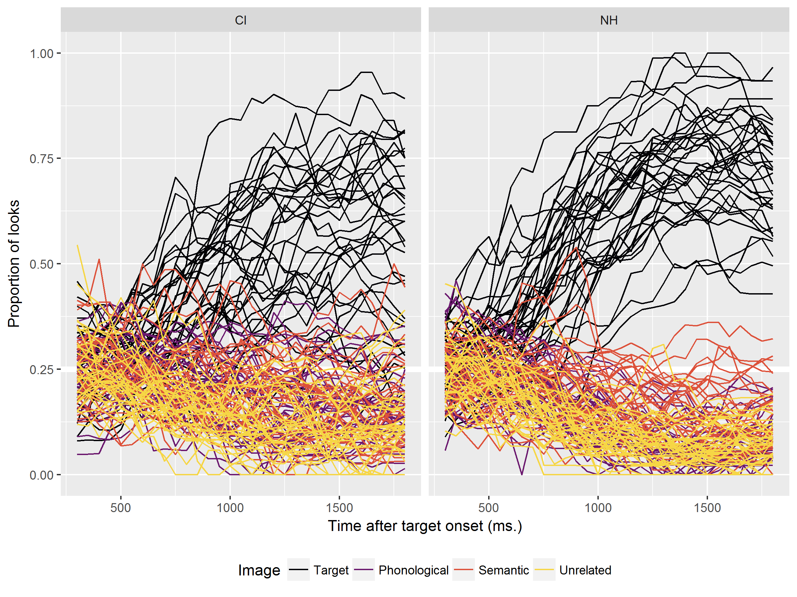
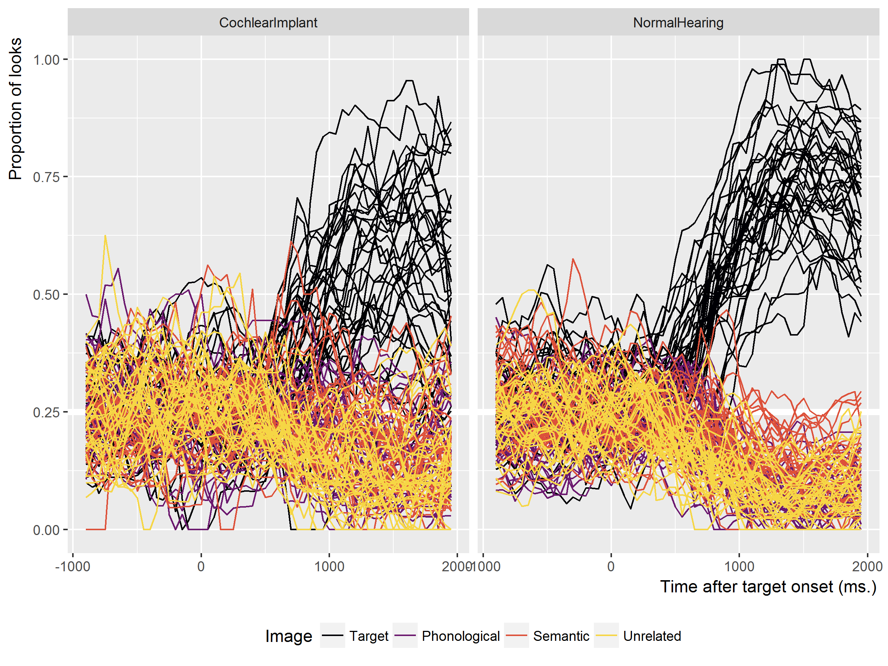

Comparison of Children with Cochlear Implants and Matched Normal Hearing Peers on Four-Image Word Recognition Task
================
Tristan Mahr
2017-01-20

The Request
-----------

> I also wanted to ask you if you would have the time to help me get the data ready for the analysis of the CI data for the RWL task. Here's what I've done so far:
>
> 1.  Put together the CI particpants
>
> <!-- -->
>
> 1.  Omitted those tested before 1/15 (2 longitudinal participants)
> 2.  Omitted those with more than 50% missing data across two blocks. I did include participants who had only 1 block with a low percentage of missing data.
>
> <!-- -->
>
> 1.  Matched these to NH participants.
>
> <!-- -->
>
> 1.  Group matched for age, maternal education, sex.
> 2.  Group matched for number of test visits (the same number of participants in each group have 1 visit, 2 visits \[1 year apart\], 3 visits \[1 year apart\]).
> 3.  Made sure that none of the NH matches have excessive missing data or were tested before 1/15.
>
> Could you do the following for me:
>
> 1.  Make a data frame that has the RWL eye-tracking data along with the usual subject-level information of interest (PPVT\_GSV \[if available\], EVT\_GSV, age, medu, GFTA \[if available\]).
> 2.  Exclude blocks with more than 50% missing data and trials with more than 50% missing data.
> 3.  Plot the data for the two groups (looks to the four images) for the time frame 300 to 1800 ms?

Load in the list of participants.

``` r
library(dplyr)
library(L2TDatabase)

# Work relative to RStudio project
wd <- rprojroot::find_rstudio_root_file()
dir_here <- file.path(wd, "inst", "analyses", "rwl_ci_nh_matches")
cnf_file <- file.path(wd, "inst", "l2t_db.cnf")

# Load in the matches
df_kids <- file.path(dir_here, "ci_matches.csv") %>% 
  readr::read_csv(col_types = "ccic") %>% 
  print()
#> # A tibble: 72 × 4
#>    Group ShortResearchID   Age      Study
#>    <chr>           <chr> <int>      <chr>
#> 1     CI            300E    57 CochlearV1
#> 2     CI            300E    69 CochlearV2
#> 3     CI            301E    53 CochlearV1
#> 4     CI            301E    69 CochlearV2
#> 5     CI            302E    37 CochlearV1
#> 6     CI            302E    49 CochlearV2
#> 7     CI            303E    65 CochlearV1
#> 8     CI            304E    59 CochlearV2
#> 9     CI            305E    44 CochlearV1
#> 10    CI            305E    56 CochlearV2
#> # ... with 62 more rows
```

We need to get scores from the following studies.

``` r
unique(df_kids$Study)
#> [1] "CochlearV1"       "CochlearV2"       "TimePoint2"      
#> [4] "TimePoint3"       "TimePoint1"       "CochlearMatching"
```

We have queries that combine the various scores together for each study in the main database. They have the pattern `Scores_[study-name]`. Download them all, combine and select the requested columns.

``` r
l2t_main <- l2t_connect(cnf_file, "l2t")
query_names <- paste0("Scores_", unique(df_kids$Study))

df_scores <- query_names %>% 
  # Download the each study's query
  lapply(function(tbl_name) tbl(l2t_main, tbl_name)) %>% 
  lapply(collect) %>% 
  # Combine into a single data-frame
  bind_rows() %>% 
  select(Study, ShortResearchID = ResearchID, 
         Female, AAE, LateTalker, CImplant, 
         Maternal_Education, Maternal_Education_Level, 
         EVT_Age, EVT_Raw, EVT_GSV, EVT_Standard,
         PPVT_Age, PPVT_Raw, PPVT_GSV, PPVT_Standard, 
         GFTA_Age:GFTA_Standard)

# Add the scores to the participants for analysis.
df_kids <- inner_join(df_kids, df_scores)
df_kids
#> # A tibble: 72 × 23
#>    Group ShortResearchID   Age      Study Female   AAE LateTalker CImplant
#>    <chr>           <chr> <int>      <chr>  <int> <int>      <int>    <int>
#> 1     CI            300E    57 CochlearV1      0     0          0        1
#> 2     CI            300E    69 CochlearV2      0     0          0        1
#> 3     CI            301E    53 CochlearV1      1     0          0        1
#> 4     CI            301E    69 CochlearV2      1     0          0        1
#> 5     CI            302E    37 CochlearV1      1     0          0        1
#> 6     CI            302E    49 CochlearV2      1     0          0        1
#> 7     CI            303E    65 CochlearV1      1     0          0        1
#> 8     CI            304E    59 CochlearV2      1     0          0        1
#> 9     CI            305E    44 CochlearV1      1     0          0        1
#> 10    CI            305E    56 CochlearV2      1     0          0        1
#> # ... with 62 more rows, and 15 more variables: Maternal_Education <chr>,
#> #   Maternal_Education_Level <int>, EVT_Age <int>, EVT_Raw <int>,
#> #   EVT_GSV <int>, EVT_Standard <int>, PPVT_Age <int>, PPVT_Raw <int>,
#> #   PPVT_GSV <int>, PPVT_Standard <int>, GFTA_Age <int>,
#> #   GFTA_RawCorrect <int>, GFTA_NumTranscribed <int>,
#> #   GFTA_AdjCorrect <int>, GFTA_Standard <int>
```

We can confirm adequate matching.

``` r
df_kids %>% 
  group_by(Group) %>% 
  summarise(
    N = n(),
    CI = sum(CImplant),
    N_Female = sum(Female),
    N_Male = sum(Female == 0),
    N_EVT = sum(!is.na(EVT_Age)),
    EVT_Age = mean(EVT_Age, na.rm = TRUE),
    N_PPVT = sum(!is.na(PPVT_Age)),
    PPVT_Age = mean(PPVT_Age, na.rm = TRUE),
    N_GFTA = sum(!is.na(GFTA_Age)),
    GFTA_Age = mean(GFTA_Age, na.rm = TRUE))
#> # A tibble: 2 × 11
#>   Group     N    CI N_Female N_Male N_EVT  EVT_Age N_PPVT PPVT_Age N_GFTA
#>   <chr> <int> <int>    <int>  <int> <int>    <dbl>  <int>    <dbl>  <int>
#> 1    CI    36    36       21     15    36 52.63889     36    52.50     33
#> 2    NH    36     0       19     17    36 51.86111     20    45.75     20
#> # ... with 1 more variables: GFTA_Age <dbl>
```

Let's also get the children's database IDs from the backend database so that we can pull their data from the eyetracking database.

``` r
l2t_be <- l2t_connect(cnf_file, "backend")

df_cds <- tbl(l2t_be, "Child") %>% 
  left_join(tbl(l2t_be, "ChildStudy")) %>% 
  left_join(tbl(l2t_be, "Study")) %>% 
  select(Study, ShortResearchID, ChildStudyID, Birthdate) %>% 
  collect() %>% 
  # Keep just the kids in the analysis
  semi_join(df_kids)
```

This is a tedious step. We need to download the eyetracking data. First, let's connect to the database and prepare some queries.

``` r
l2t_eyetracking <- l2t_connect(cnf_file, "eyetracking")

# We could do this with the prepared queries (q_BlocksByStudy, etc.), but the 
# query q_LooksByStudy takes forever to run. So we will select identify the
# blocks we want and get the trials and looks for just those blocks. That should
# be faster than start with all the data and narrowing down to the subset we
# want.

# Find the numbers of the blocks 
tbl_blocks <- tbl(l2t_eyetracking, "Blocks") %>% 
  filter(Block_Task == "RWL", 
         ChildStudyID %in% df_cds$ChildStudyID) %>% 
  select(BlockID, ChildStudyID, Block_Basename, 
         Block_DateTime, Block_Task, Block_Version)

# Get the attributes for these blocks
tbl_blocks_attrs <- tbl(l2t_eyetracking, "BlockAttributes") %>% 
  inner_join(tbl_blocks) %>% 
  select(ChildStudyID, BlockID, BlockAttribute_Name, BlockAttribute_Value)

# Get trial id numbers for these blocks
tbl_trials <- tbl(l2t_eyetracking, "Trials") %>% 
  inner_join(tbl_blocks) %>% 
  select(ChildStudyID, BlockID, TrialID, Trial_TrialNo)

# Get attributes of the trials
tbl_trials_attrs <- tbl(l2t_eyetracking, "TrialAttributes") %>% 
  inner_join(tbl_trials) %>% 
  select(ChildStudyID, BlockID, TrialID, 
         TrialAttribute_Name, TrialAttribute_Value)

# The big one. Get the looking data for these trials.
tbl_looks <- tbl(l2t_eyetracking, "Looks") %>% 
  inner_join(tbl_trials) %>% 
  select(ChildStudyID, BlockID, TrialID, Time, GazeByImageAOI, GazeByAOI)
```

Downloading the data takes forever, so I'm going set a flag called `refresh`. When `refresh` is true, it will redownload the eyetracking data with those queries. Otherwise, it will load the last copy that I saved.

``` r
refresh <- FALSE

if (!refresh) {
  df_looks <- readr::read_csv(file.path(dir_here, "looks.csv"))
  df_blocks <- df_looks %>% 
    select(Study, ShortResearchID, Block_Age, 
           Block_Basename, Block_Dialect) %>% 
    distinct()
} else {
  df_blocks <- collect(tbl_blocks) %>% 
    left_join(df_cds) %>% 
    # Compute child's age in months when they did eyetracking block
    mutate(Block_Date = as.Date(Block_DateTime),
           Block_Age = chrono_age(Birthdate, Block_Date)) %>% 
    group_by(ChildStudyID) %>% 
    # We want one age per child, so use earliest. This might be dubious. 
    mutate(Block_Age = min(Block_Age)) %>% 
    ungroup()
  
  # Get the dialect
  df_blocks_attrs <- collect(tbl_blocks_attrs) %>% 
    # Pivot from long to wide so have the attributes we want
    tidyr::spread(BlockAttribute_Name, BlockAttribute_Value) %>% 
    select(ChildStudyID, BlockID, Block_Dialect = Dialect)
  
  # Add dialect to block info
  df_blocks <- df_blocks %>% 
    select(Study, ShortResearchID, BlockID, Block_Age, Block_Basename) %>% 
    left_join(df_blocks_attrs) 
  
  df_trials <- collect(tbl_trials)
  df_trials_attrs <- collect(tbl_trials_attrs)
  
  # I just noticed I spelt stimulus wrong when I uploaded the trial
  # info to the database. Make attribute names a bit cleaner.
  clean_attr_names <- function(xs) {
    xs %>% 
      stringr::str_replace("Stimlulus", "Stimulus") %>% 
      stringr::str_replace("^(Stimulus|Image)(Lower|Upper)", "\\1_\\2")
  }
  
  df_trials_attrs <- df_trials_attrs %>% 
    mutate(TrialAttribute_Name = clean_attr_names(TrialAttribute_Name)) %>% 
    # Pivot from long to wide so have the attributes we want
    tidyr::spread(TrialAttribute_Name, TrialAttribute_Value) %>% 
    select(ChildStudyID, BlockID, TrialID, TargetImage,
           # Where they were looking the most during 0-250ms
           Bias_ImageAOI, starts_with("Image_"), starts_with("Stimulus_"))
  
  # Do a little work unpacking which word was where onscreen and what kind of
  # foil it was
  df_words <- df_trials_attrs %>% 
    select(TrialID, starts_with("Image_"), starts_with("Stimulus_")) %>% 
    # Back to long format and split underscore into two columns
    tidyr::gather(Key, Value, -TrialID) %>% 
    tidyr::separate(Key, c("Property", "Location")) %>% 
    tidyr::spread(Property, Value) %>% 
    mutate(Word = stringr::str_extract(Image, "[A-z]+")) %>% 
    select(-Image, -Location) %>% 
    tidyr::spread(Stimulus, Word)
    
  df_trials <- df_trials_attrs %>% 
    left_join(df_words) %>% 
    left_join(df_trials)
  
  df_looks <- collect(tbl_looks, n = Inf)
  
  df_looks <- df_blocks %>% 
    left_join(df_trials) %>% 
    left_join(df_looks) %>% 
    select(-BlockID, -ChildStudyID, -TrialID)
    
  readr::write_csv(df_looks, file.path(dir_here, "looks.csv"))
}
```

Let's kick out bad trials and blocks.

``` r
df_blocks_to_drop <- df_looks %>% 
  filter(between(Time, 280, 1820)) %>% 
  lookr::AggregateLooks(Study + ShortResearchID + 
                          Block_Basename ~ GazeByImageAOI) %>% 
  as_data_frame() %>% 
  filter(PropNA > .5) %>% 
  select(Study:Block_Basename, PropNA) %>% 
  print(n = Inf)
#> # A tibble: 10 × 4
#>         Study ShortResearchID       Block_Basename    PropNA
#>         <chr>           <chr>                <chr>     <dbl>
#> 1  CochlearV1            300E RWL_Block2_300E57MS2 0.5353943
#> 2  CochlearV1            301E RWL_Block2_301E53FS2 0.7379032
#> 3  CochlearV1            303E RWL_Block1_303E65FS2 0.6079749
#> 4  CochlearV1            312E RWL_Block2_312E44FS1 0.6142473
#> 5  CochlearV1            801E RWL_Block1_801E38MS1 0.5689964
#> 6  TimePoint2            659L RWL_Block2_659L44FS3 0.6096307
#> 7  TimePoint2            665L RWL_Block1_665L52FS4 0.5918459
#> 8  TimePoint2            665L RWL_Block2_665L52FS4 0.5712366
#> 9  TimePoint3            014L RWL_Block2_014L63MS6 0.6146953
#> 10 TimePoint3            665L RWL_Block2_665L64FS6 0.7475456

df_trials_to_drop <- df_looks %>% 
  anti_join(df_blocks_to_drop) %>% 
  filter(between(Time, 280, 1820)) %>% 
  lookr::AggregateLooks(Study + ShortResearchID + Block_Basename + 
                          Trial_TrialNo ~ GazeByImageAOI) %>% 
  as_data_frame() %>% 
  filter(PropNA > .5) %>% 
  select(Study:Trial_TrialNo, PropNA) %>% 
  print()
#> # A tibble: 400 × 5
#>               Study ShortResearchID       Block_Basename Trial_TrialNo
#>               <chr>           <chr>                <chr>         <int>
#> 1  CochlearMatching            391A RWL_Block2_391A65MS3             4
#> 2  CochlearMatching            391A RWL_Block2_391A65MS3            13
#> 3  CochlearMatching            391A RWL_Block2_391A65MS3            16
#> 4  CochlearMatching            393A RWL_Block1_393A69MS3            22
#> 5        CochlearV1            300E RWL_Block1_300E57MS2             1
#> 6        CochlearV1            300E RWL_Block1_300E57MS2             3
#> 7        CochlearV1            300E RWL_Block1_300E57MS2             9
#> 8        CochlearV1            300E RWL_Block1_300E57MS2            19
#> 9        CochlearV1            300E RWL_Block1_300E57MS2            20
#> 10       CochlearV1            300E RWL_Block1_300E57MS2            21
#> # ... with 390 more rows, and 1 more variables: PropNA <dbl>

df_looks <- df_looks %>% 
  anti_join(df_blocks_to_drop) %>% 
  anti_join(df_trials_to_drop)
```

Let's downsample into 50ms bins, and aggregate the number of looks.

``` r
df_bins <- df_looks %>% 
  distinct(Time) %>%
  # Need a number of frames divisible three. Time 0 should be center of its bin
  filter(between(Time, -917, 1975)) %>% 
  arrange(Time) %>% 
  mutate(Bin = lookr::AssignBins(Time, bin_width = 3)) %>%
  group_by(Bin) %>% 
  # Round to nearest 50ms
  mutate(BinTime = Time %>% median() %>% round(-1)) %>% 
  ungroup()

df_binned <- df_looks %>% 
  inner_join(df_bins) %>%
  select(Study, ShortResearchID, Trial_TrialNo, 
         Time, BinTime, GazeByImageAOI, GazeByAOI) %>% 
  lookr::AggregateLooks(Study + ShortResearchID + BinTime ~ GazeByImageAOI) %>% 
  as_data_frame() %>% 
  mutate(Looks_Images = Target + Others,
         Prop_Target = Target / Looks_Images,
         Prop_PhonologicalFoil = PhonologicalFoil / Looks_Images,
         Prop_SemanticFoil = SemanticFoil / Looks_Images,
         Prop_Unrelated = Unrelated / Looks_Images)
df_binned
#> # A tibble: 4,118 × 19
#>               Study ShortResearchID BinTime PhonologicalFoil SemanticFoil
#>               <chr>           <chr>   <dbl>            <int>        <int>
#> 1  CochlearMatching            390A    -900               27           27
#> 2  CochlearMatching            390A    -850               27           25
#> 3  CochlearMatching            390A    -800               30           22
#> 4  CochlearMatching            390A    -750               30           21
#> 5  CochlearMatching            390A    -700               27           21
#> 6  CochlearMatching            390A    -650               29           22
#> 7  CochlearMatching            390A    -600               32           24
#> 8  CochlearMatching            390A    -550               30           30
#> 9  CochlearMatching            390A    -500               30           30
#> 10 CochlearMatching            390A    -450               30           30
#> # ... with 4,108 more rows, and 14 more variables: Target <int>,
#> #   Elsewhere <int>, Unrelated <int>, NAs <int>, Others <dbl>,
#> #   Looks <dbl>, Proportion <dbl>, ProportionSE <dbl>, PropNA <dbl>,
#> #   Looks_Images <dbl>, Prop_Target <dbl>, Prop_PhonologicalFoil <dbl>,
#> #   Prop_SemanticFoil <dbl>, Prop_Unrelated <dbl>
```

If we want to plot a growth curve for image type (target, semantic foil, etc.), we need to reshape into a long format to have a Proportion column and an Image type column.

``` r
df_looks_to_aois <- df_binned %>% 
  select(Study, ShortResearchID, Time = BinTime, starts_with("Prop_")) %>% 
  tidyr::gather(AOI, Proportion, -Study, -ShortResearchID, -Time) %>% 
  mutate(AOI = AOI %>% 
           stringr::str_replace("Prop_", "") %>% 
           stringr::str_replace("Foil", "")) 

df_looks_to_aois$AOI <- factor(
  df_looks_to_aois$AOI, 
  levels = c("Target", "Phonological", "Semantic", "Unrelated"))
```

Do some spaghetti plots

``` r
library(ggplot2)
df_looks_to_aois <- left_join(df_looks_to_aois, df_kids) %>% 
  mutate(LineGroup = interaction(Study, ShortResearchID, AOI))

curr_labs <- labs(
  x = "Time after target onset (ms.)", 
  y = "Proportion of looks", 
  color = "Image") 

p_theme <- theme_grey(base_size = 11) + 
  theme(legend.position = "bottom")

p1 <- ggplot(df_looks_to_aois) + 
  aes(x = Time, y = Proportion, color = AOI, group = LineGroup) + 
  geom_hline(yintercept = .25, size = 2, color = "white") + 
  geom_line() + 
  facet_wrap("Group") +
  p_theme + curr_labs
p1  
```


Replace data-set in last plot with one with a narrow time window.

``` r
df_looks_to_aois_window <- df_looks_to_aois %>% 
  filter(between(Time, 300, 1800))

p1 %+% df_looks_to_aois_window
```


Show average of each participant's lines.

``` r
p2 <- ggplot(df_looks_to_aois) + 
  aes(x = Time, y = Proportion, color = AOI) + 
  geom_hline(yintercept = .25, size = 2, color = "white") + 
  stat_summary(fun.data = mean_se, geom = "pointrange") +
  facet_wrap("Group") +
  p_theme + curr_labs
p2  
```



``` r
p2b <- ggplot(df_looks_to_aois_window) + 
  aes(x = Time, y = Proportion, color = AOI) + 
  geom_hline(yintercept = .25, size = 2, color = "white") + 
  stat_summary(fun.data = mean_se, geom = "pointrange") +
  facet_wrap("Group") +
  p_theme + curr_labs
p2b 
```


Actually, we don't need to facet them.

``` r
p3 <- ggplot(df_looks_to_aois) + 
  aes(x = Time, y = Proportion, color = AOI, shape = Group) + 
  geom_hline(yintercept = .25, size = 2, color = "white") + 
  stat_summary(fun.data = mean_se, geom = "pointrange") +
  p_theme + curr_labs
p3
```



And zoom in.

``` r
p4 <- ggplot(df_looks_to_aois_window) + 
  aes(x = Time, y = Proportion, color = AOI, shape = Group) + 
  geom_hline(yintercept = .25, size = 2, color = "white") + 
  stat_summary(fun.data = mean_se, geom = "pointrange") +
  p_theme + curr_labs
p4
```


Compare each mean of curve.

``` r
p5 <- ggplot(df_looks_to_aois_window) + 
  aes(x = Time, y = Proportion, linetype = Group) + 
  geom_hline(yintercept = .25, size = 2, color = "white") + 
  stat_summary(fun.y = mean, geom = "line", size = 1.25) +
  facet_wrap("AOI") +
  p_theme + curr_labs
p5
```


Save a final data-set.

``` r
df_ages <- df_blocks %>% 
  select(Study, ShortResearchID, Age = Block_Age) %>% 
  distinct()

df_subj_vars <- df_kids %>% 
  select(-Age) %>% 
  left_join(df_ages) %>% 
  select(Group, Study, ShortResearchID, Age, Female:GFTA_Standard) %>% 
  distinct() %>% 
  arrange(Group, Study, ShortResearchID)

df_long_props <- df_looks_to_aois_window %>% 
  left_join(df_subj_vars) %>% 
  select(Group, Study, ShortResearchID, Age:GFTA_Standard, 
         Time, AOI, Proportion) %>% 
  arrange(Group, Study, ShortResearchID, AOI, Time)

df_look_counts <- df_binned %>% 
  rename(LooksToTarget = Target, LooksToFoils = Others, 
         ProportionToTarget = Proportion, Time = BinTime) %>% 
  left_join(df_subj_vars) %>% 
  select(Group, Study, ShortResearchID, Age:GFTA_Standard, 
         Time, ProportionToTarget, LooksToTarget, LooksToFoils, 
         PhonologicalFoil, SemanticFoil, Unrelated) %>% 
  filter(between(Time, 300, 1800)) %>% 
  arrange(Group, Study, ShortResearchID)

readr::write_csv(df_subj_vars, file.path(dir_here, "subj_info.csv"))

readr::write_csv(
  df_long_props, 
  file.path(dir_here, "long_prop_looks_to_each_aoi.csv"))

readr::write_csv(
  df_look_counts, 
  file.path(dir_here, "wide_num_looks_to_each_aoi.csv"))
```
