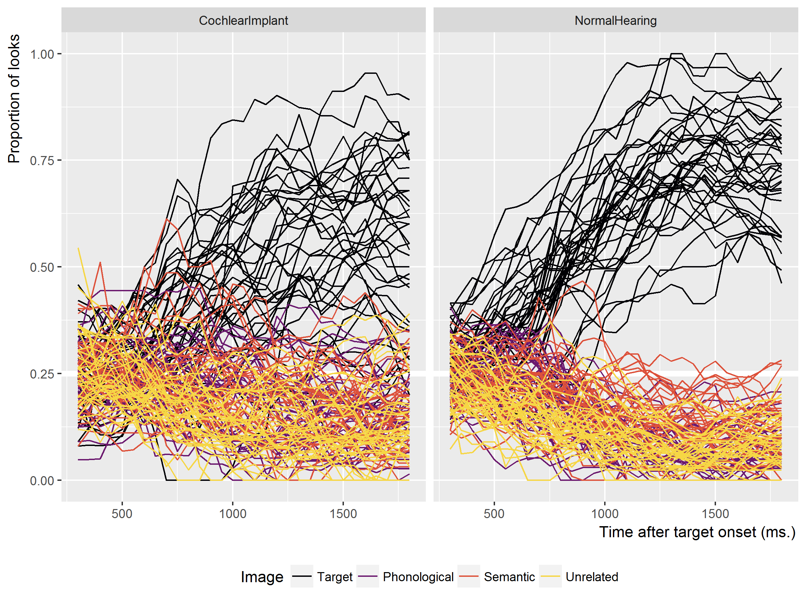
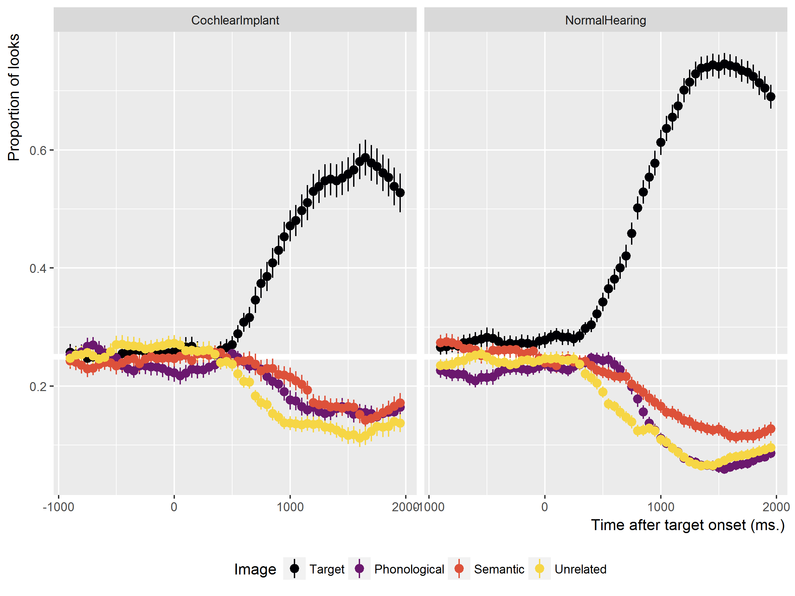

Comparison of Children with Cochlear Implants and Matched Normal Hearing Peers on Four-Image Word Recognition Task
================
Tristan Mahr
2017-05-03

Download the matches
--------------------

Load in the list of participants. The table of matches is stored in a table called `CIMatching` in the database. We connect to the database, grab that table and the test scores for the children in that table.

``` r
library(dplyr)
library(L2TDatabase)

# We use the main RStudio project directory as the working folder 
# for this session.
wd <- rprojroot::find_rstudio_root_file()
dir_here <- file.path(wd, "inst", "analyses", "rwl_ci_nh_matches")
cnf_file <- file.path(wd, "inst", "l2t_db.cnf")

# Connect to database
l2t_main <- l2t_connect(cnf_file, "l2t")

# Download matches and scores from various tests
df_matches <- tbl(l2t_main, "CIMatching") %>% 
  left_join(tbl(l2t_main, "EVT")) %>% 
  left_join(tbl(l2t_main, "PPVT")) %>% 
  left_join(tbl(l2t_main, "GFTA")) %>% 
  select(Group = Matching_Group, Matching_PairNumber, ChildStudyID, 
         Study, ResearchID, 
         Female, AAE, LateTalker, CImplant, 
         Maternal_Education, Maternal_Education_Level, 
         EVT_Age, EVT_Raw, EVT_GSV, EVT_Standard,
         PPVT_Age, PPVT_Raw, PPVT_GSV, PPVT_Standard, 
         GFTA_Age:GFTA_Standard) %>% 
  collect()
df_matches
#> # A tibble: 82 × 24
#>              Group Matching_PairNumber ChildStudyID      Study ResearchID
#>              <chr>               <int>        <int>      <chr>      <chr>
#> 1    NormalHearing                  36          287 TimePoint2       630L
#> 2    NormalHearing                  17          294 TimePoint2       640L
#> 3  CochlearImplant                  28          308 TimePoint2       665L
#> 4  CochlearImplant                  31          319 TimePoint2       679L
#> 5    NormalHearing                  10          328 TimePoint2       002L
#> 6    NormalHearing                  12          335 TimePoint2       010L
#> 7    NormalHearing                  35          338 TimePoint2       014L
#> 8    NormalHearing                  20          354 TimePoint2       030L
#> 9    NormalHearing                   8          368 TimePoint2       044L
#> 10   NormalHearing                  22          375 TimePoint2       052L
#> # ... with 72 more rows, and 19 more variables: Female <int>, AAE <int>,
#> #   LateTalker <int>, CImplant <int>, Maternal_Education <chr>,
#> #   Maternal_Education_Level <int>, EVT_Age <int>, EVT_Raw <int>,
#> #   EVT_GSV <int>, EVT_Standard <int>, PPVT_Age <int>, PPVT_Raw <int>,
#> #   PPVT_GSV <int>, PPVT_Standard <int>, GFTA_Age <int>,
#> #   GFTA_RawCorrect <int>, GFTA_NumTranscribed <int>,
#> #   GFTA_AdjCorrect <int>, GFTA_Standard <int>
```

We can confirm adequate matching on (EVT) Age and sex.

``` r
df_matches %>% 
  group_by(Group) %>% 
  summarise(
    N = n(),
    CI = sum(CImplant),
    N_Female = sum(Female),
    N_Male = sum(Female == 0),
    N_EVT = sum(!is.na(EVT_Age)),
    EVT_Age = mean(EVT_Age, na.rm = TRUE),
    N_PPVT = sum(!is.na(PPVT_Age)),
    PPVT_Age = mean(PPVT_Age, na.rm = TRUE),
    N_GFTA = sum(!is.na(GFTA_Age)),
    GFTA_Age = mean(GFTA_Age, na.rm = TRUE)) %>% 
  knitr::kable()
```

| Group           |    N|   CI|  N\_Female|  N\_Male|  N\_EVT|  EVT\_Age|  N\_PPVT|  PPVT\_Age|  N\_GFTA|  GFTA\_Age|
|:----------------|----:|----:|----------:|--------:|-------:|---------:|--------:|----------:|--------:|----------:|
| CochlearImplant |   41|   41|         25|       16|      41|  50.09756|       41|   49.95122|       37|   50.27027|
| NormalHearing   |   41|    0|         25|       16|      41|  50.09756|       23|   43.08696|       27|   51.62963|

We also matched by general maternal education.

``` r
df_matches %>% 
  count(Group, Maternal_Education) %>% 
  ungroup() %>%
  tidyr::spread(Group, n) %>% 
  knitr::kable()
```

| Maternal\_Education          |  CochlearImplant|  NormalHearing|
|:-----------------------------|----------------:|--------------:|
| College Degree               |               18|             18|
| Graduate Degree              |               12|             12|
| High School Diploma          |                3|              2|
| Less Than High School        |               NA|              1|
| Some College (2+ years)      |                3|              3|
| Technical/Associate's Degree |                5|              4|
| Trade School                 |               NA|              1|

We can also compute summary statistics.

``` r
df_matches %>% 
  select(Group, EVT_Age, EVT_Standard, PPVT_Standard, GFTA_Standard) %>% 
  # Convert to long format to compute summaries by group by score type
  tidyr::gather(Variable, Value, -Group) %>% 
  tidyr::drop_na(Value) %>% 
  group_by(Variable, Group) %>% 
  summarise(N_Values = n(), Mean = mean(Value), SD = sd(Value), 
            Min = min(Value), Max = max(Value)) %>% 
  # Round off decimals
  mutate_each_(funs(round), vars = vars(Mean, SD, Min, Max)) %>% 
  ungroup() %>% 
  knitr::kable()
```

| Variable       | Group           |  N\_Values|  Mean|   SD|  Min|  Max|
|:---------------|:----------------|----------:|-----:|----:|----:|----:|
| EVT\_Age       | CochlearImplant |         41|    50|   10|   31|   66|
| EVT\_Age       | NormalHearing   |         41|    50|   10|   32|   66|
| EVT\_Standard  | CochlearImplant |         40|    98|   19|   46|  131|
| EVT\_Standard  | NormalHearing   |         41|   118|   11|   88|  134|
| GFTA\_Standard | CochlearImplant |         37|    74|   19|   39|  107|
| GFTA\_Standard | NormalHearing   |         27|    92|   12|   67|  113|
| PPVT\_Standard | CochlearImplant |         40|    94|   21|   40|  139|
| PPVT\_Standard | NormalHearing   |         23|   120|   11|   94|  140|

Download the eyetracking data
-----------------------------

This is a tedious step. We need to download the eyetracking data. First, let's connect to the database and prepare some queries.

``` r
l2t_eyetracking <- l2t_connect(cnf_file, "eyetracking")

# We could do this with the prepared queries (q_BlocksByStudy, etc.), but the 
# query q_LooksByStudy takes forever to run. So we will select identify the
# blocks we want and get the trials and looks for just those blocks. That should
# be faster than start with all the data and narrowing down to the subset we
# want.

# Find the numbers of the blocks 
tbl_blocks <- tbl(l2t_eyetracking, "Blocks") %>% 
  filter(ChildStudyID %in% df_matches$ChildStudyID) %>% 
  select(BlockID, ChildStudyID, Block_Basename, 
         Block_DateTime, Block_Task, Block_Version, Block_Age)

# Get the attributes for these blocks
tbl_blocks_attrs <- tbl(l2t_eyetracking, "BlockAttributes") %>% 
  inner_join(tbl_blocks) %>% 
  select(ChildStudyID, BlockID, BlockAttribute_Name, BlockAttribute_Value)

# Get trial id numbers for these blocks
tbl_trials <- tbl(l2t_eyetracking, "Trials") %>% 
  inner_join(tbl_blocks) %>% 
  select(ChildStudyID, BlockID, TrialID, Trial_TrialNo)

# Get attributes of the trials
tbl_trials_attrs <- tbl(l2t_eyetracking, "TrialAttributes") %>% 
  inner_join(tbl_trials) %>% 
  select(ChildStudyID, BlockID, TrialID, 
         TrialAttribute_Name, TrialAttribute_Value)

# The big one. Get the looking data for these trials.
tbl_looks <- tbl(l2t_eyetracking, "Looks") %>% 
  inner_join(tbl_trials) %>% 
  select(ChildStudyID, BlockID, TrialID, Time, GazeByImageAOI, GazeByAOI)
```

Downloading the data takes forever, so I'm going set a flag called `refresh`. When `refresh` is true, it will redownload the eyetracking data with those queries. Otherwise, it will load the last copy that I saved.

``` r
refresh <- TRUE

if (!refresh) {
  df_looks <- readr::read_csv(file.path(dir_here, "looks.csv"))
  df_blocks <- df_looks %>% 
    select(Study, ShortResearchID, Block_Age, 
           Block_Basename, Block_Dialect) %>% 
    distinct()
} else {
  
  df_blocks <- collect(tbl_blocks) %>% 
    left_join(df_matches) %>%
    group_by(Block_Task, ChildStudyID) %>%
    # We want one age per child, so use earliest. This might be dubious.
    mutate(Block_Age = min(Block_Age)) %>%
    ungroup()
     
  # Get the dialect and stimulus version
  df_blocks_attrs <- collect(tbl_blocks_attrs) %>% 
    # Pivot from long to wide so have the attributes we want
    tidyr::spread(BlockAttribute_Name, BlockAttribute_Value) %>% 
    select(ChildStudyID, BlockID, 
           Block_Dialect = Dialect, StimulusSet)
  
  # Add dialect to block info
  df_blocks <- df_blocks %>% 
    select(Block_Task, Study, ResearchID, BlockID, Block_Age, 
           Block_Basename, Block_Version) %>% 
    left_join(df_blocks_attrs) 
  
  df_trials <- collect(tbl_trials)
  
  
  df_trials_attrs <- collect(tbl_trials_attrs, n = Inf)

  df_looks <- collect(tbl_looks, n = Inf)
  
  df_looks <- df_blocks %>% 
    left_join(df_trials) %>% 
    left_join(df_looks) %>% 
    select(-BlockID, -ChildStudyID, -TrialID)
    
  # readr::write_csv(df_looks, file.path(dir_here, "looks.csv"))
}
```

Data-screening for each eyetracking experiment
----------------------------------------------

We exclude blocks with the TimePoint1 version of the experiment stimuli.

``` r
df_bad_version <- df_blocks %>% 
  filter(StimulusSet == "TP1") %>% 
  select(Block_Task:ResearchID, Block_Basename, StimulusSet) %>% 
  print()
#> # A tibble: 51 × 5
#>    Block_Task      Study ResearchID       Block_Basename StimulusSet
#>         <chr>      <chr>      <chr>                <chr>       <chr>
#> 1         RWL TimePoint1       605L RWL_Block1_605L31MS1         TP1
#> 2         RWL TimePoint1       605L RWL_Block2_605L31MS1         TP1
#> 3          MP TimePoint1       605L  MP_Block1_605L31MS1         TP1
#> 4          MP TimePoint1       605L  MP_Block2_605L31MS1         TP1
#> 5         RWL TimePoint1       608L RWL_Block1_608L39FS2         TP1
#> 6         RWL TimePoint1       608L RWL_Block2_608L39FS2         TP1
#> 7          MP TimePoint1       608L  MP_Block1_608L39FS2         TP1
#> 8          MP TimePoint1       608L  MP_Block2_608L39FS2         TP1
#> 9         RWL TimePoint1       665L RWL_Block1_665L40FS2         TP1
#> 10         MP TimePoint1       665L  MP_Block1_665L40FS2         TP1
#> # ... with 41 more rows
```

We identify blocks with more than 50% missing data during some analysis window (here 300--1800 ms).

``` r
df_blocks_to_drop <- df_looks %>% 
  anti_join(df_bad_version) %>% 
  # Offset by 20 ms because the data binned into 50ms bins: I.e., the frame at
  # 285ms is part of the [285, 300, 315] ms bin, so that frame needs to part of
  # the data screening.
  filter(between(Time, 280, 1820)) %>% 
  lookr::AggregateLooks(Block_Task + Study + ResearchID + 
                          Block_Basename ~ GazeByImageAOI) %>% 
  as_data_frame() %>% 
  filter(PropNA > .5) %>% 
  select(Block_Task:Block_Basename, PropNA) %>% 
  mutate(PropNA = round(PropNA, 3)) %>% 
  print(n = Inf)
#> # A tibble: 20 × 5
#>    Block_Task      Study ResearchID       Block_Basename PropNA
#>         <chr>      <chr>      <chr>                <chr>  <dbl>
#> 1          MP TimePoint2       605L  MP_Block1_605L43MS3  0.881
#> 2          MP TimePoint2       665L  MP_Block2_665L52FS4  0.655
#> 3          MP TimePoint2       679L  MP_Block1_679L46MS4  0.524
#> 4          MP TimePoint3       605L  MP_Block1_605L55MS5  0.749
#> 5          MP TimePoint3       605L  MP_Block2_605L55MS5  0.864
#> 6          MP TimePoint3       665L  MP_Block1_665L64FS6  0.772
#> 7          MP TimePoint3       679L  MP_Block1_679L58MS6  0.532
#> 8         RWL CochlearV1       300E RWL_Block2_300E57MS2  0.535
#> 9         RWL CochlearV1       301E RWL_Block2_301E53FS2  0.738
#> 10        RWL CochlearV1       303E RWL_Block1_303E65FS2  0.608
#> 11        RWL CochlearV1       304E RWL_Block1_304E48FS2  0.533
#> 12        RWL CochlearV1       312E RWL_Block2_312E44FS1  0.614
#> 13        RWL CochlearV1       801E RWL_Block1_801E38MS1  0.569
#> 14        RWL CochlearV2       312E RWL_Block1_312E57FS2  0.590
#> 15        RWL TimePoint2       605L RWL_Block2_605L43MS3  0.716
#> 16        RWL TimePoint2       665L RWL_Block1_665L52FS4  0.592
#> 17        RWL TimePoint2       665L RWL_Block2_665L52FS4  0.571
#> 18        RWL TimePoint3       605L RWL_Block1_605L55MS5  0.780
#> 19        RWL TimePoint3       605L RWL_Block2_605L55MS5  0.789
#> 20        RWL TimePoint3       665L RWL_Block2_665L64FS6  0.748
```

Next, we drop individual trials with more than 50% missing data.

``` r
df_trials_to_drop <- df_looks %>% 
  anti_join(df_blocks_to_drop) %>% 
  filter(between(Time, 280, 1820)) %>% 
  lookr::AggregateLooks(Block_Task + Study + ResearchID + Block_Basename + 
                          Trial_TrialNo ~ GazeByImageAOI) %>% 
  as_data_frame() %>% 
  filter(PropNA > .5) %>% 
  select(Block_Task:Trial_TrialNo, PropNA) %>% 
  mutate(PropNA = round(PropNA, 3)) %>% 
  print()
#> # A tibble: 1,404 × 6
#>    Block_Task      Study ResearchID      Block_Basename Trial_TrialNo
#>         <chr>      <chr>      <chr>               <chr>         <int>
#> 1          MP CochlearV1       300E MP_Block1_300E57MS2             2
#> 2          MP CochlearV1       300E MP_Block1_300E57MS2            18
#> 3          MP CochlearV1       300E MP_Block1_300E57MS2            19
#> 4          MP CochlearV1       300E MP_Block1_300E57MS2            20
#> 5          MP CochlearV1       300E MP_Block1_300E57MS2            22
#> 6          MP CochlearV1       300E MP_Block1_300E57MS2            23
#> 7          MP CochlearV1       300E MP_Block1_300E57MS2            25
#> 8          MP CochlearV1       300E MP_Block1_300E57MS2            26
#> 9          MP CochlearV1       300E MP_Block1_300E57MS2            35
#> 10         MP CochlearV1       300E MP_Block2_300E57MS2             2
#> # ... with 1,394 more rows, and 1 more variables: PropNA <dbl>

df_looks <- df_looks %>% 
  anti_join(df_blocks_to_drop) %>% 
  anti_join(df_trials_to_drop)
```

Next, we need to exclude participants who no longer have a match.

``` r
df_leftover <- df_looks %>% 
  distinct(Block_Task, Study, ResearchID) %>% 
  inner_join(df_matches)

df_leftover %>% 
  count(Block_Task, Group) %>% 
  ungroup() %>% 
  rename(NumChildren = n)
#> # A tibble: 4 × 3
#>   Block_Task           Group NumChildren
#>        <chr>           <chr>       <int>
#> 1         MP CochlearImplant          39
#> 2         MP   NormalHearing          41
#> 3        RWL CochlearImplant          37
#> 4        RWL   NormalHearing          41

df_singletons <- df_leftover %>% 
  count(Block_Task, Matching_PairNumber) %>% 
  ungroup() %>% 
  rename(NumChildrenInPair = n) %>% 
  filter(NumChildrenInPair == 1)
df_singletons
#> # A tibble: 6 × 3
#>   Block_Task Matching_PairNumber NumChildrenInPair
#>        <chr>               <int>             <int>
#> 1         MP                  22                 1
#> 2         MP                  23                 1
#> 3        RWL                   6                 1
#> 4        RWL                  22                 1
#> 5        RWL                  23                 1
#> 6        RWL                  28                 1


df_looks <- df_looks %>% 
  inner_join(df_matches %>% 
               select(Group, Matching_PairNumber, Study, ResearchID)) %>% 
  anti_join(df_singletons)
```

Now there will be the same number of children in each group x task.

``` r
df_looks %>% 
  distinct(Block_Task, Group, Study, ResearchID) %>% 
  count(Block_Task, Group) %>% 
  ungroup() %>% 
  rename(NumChildren = n)
#> # A tibble: 4 × 3
#>   Block_Task           Group NumChildren
#>        <chr>           <chr>       <int>
#> 1         MP CochlearImplant          39
#> 2         MP   NormalHearing          39
#> 3        RWL CochlearImplant          37
#> 4        RWL   NormalHearing          37

# Make sure there are 2 children in every matching pair
df_looks %>% 
  distinct(Matching_PairNumber, Block_Task, Group, Study, ResearchID) %>% 
  count(Block_Task, Matching_PairNumber) %>% 
  ungroup() %>% 
  rename(NumChildrenInPair = n) %>% 
  filter(NumChildrenInPair != 2)
#> # A tibble: 0 × 3
#> # ... with 3 variables: Block_Task <chr>, Matching_PairNumber <int>,
#> #   NumChildrenInPair <int>
```

Finally, we have to separate the RWL and the MP data, so that we can attach the information about the trials to eyetracking data.

``` r
df_mp <- df_looks %>% 
  filter(Block_Task == "MP")

df_rwl <- df_looks %>% 
  filter(Block_Task == "RWL")

df_trial_info <- df_trials_attrs %>% 
  left_join(df_trials) %>% 
  left_join(df_blocks) %>% 
  semi_join(df_looks)

# Include the MP trial information
df_mp_trial_info <- df_trial_info %>% 
  filter(Block_Task == "MP") %>% 
  tidyr::spread(TrialAttribute_Name, TrialAttribute_Value) %>% 
  select(Study, ResearchID, Block_Basename, Trial_TrialNo, 
         Condition = StimType, WordGroup, TargetWord, Bias_ImageAOI, 
         DistractorImage, FamiliarImage, UnfamiliarImage, 
         ImageL, ImageR, TargetImage)

df_mp <- df_mp %>% 
  left_join(df_mp_trial_info)


# Do the same for the RWL data
df_rwl_trial_info <- df_trial_info %>% 
  filter(Block_Task == "RWL") %>% 
  tidyr::spread(TrialAttribute_Name, TrialAttribute_Value) %>% 
  select(Study, ResearchID, Block_Basename, Trial_TrialNo, 
         TargetImage, Bias_ImageAOI,
         starts_with("Image"), starts_with("Stimulus"), starts_with("Word"))

df_rwl <- df_rwl %>% 
  left_join(df_rwl_trial_info)
```

Look at the RWL data
--------------------

Let's downsample into 50ms bins, and aggregate the number of looks.

``` r
df_bins <- df_rwl %>% 
  distinct(Time) %>%
  # Need a number of frames divisible three. Time 0 should be center of its bin
  filter(between(Time, -917, 1975)) %>% 
  arrange(Time) %>% 
  mutate(Bin = lookr::AssignBins(Time, bin_width = 3)) %>%
  group_by(Bin) %>% 
  # Round to nearest 50ms
  mutate(BinTime = Time %>% median() %>% round(-1)) %>% 
  ungroup()

df_binned <- df_rwl %>% 
  inner_join(df_bins) %>%
  select(Study, ResearchID, Trial_TrialNo, 
         Time, BinTime, GazeByImageAOI, GazeByAOI) %>% 
  lookr::AggregateLooks(Study + ResearchID + BinTime ~ GazeByImageAOI) %>% 
  as_data_frame() %>% 
  mutate(Looks_Images = Target + Others,
         Prop_Target = Target / Looks_Images,
         Prop_PhonologicalFoil = PhonologicalFoil / Looks_Images,
         Prop_SemanticFoil = SemanticFoil / Looks_Images,
         Prop_Unrelated = Unrelated / Looks_Images)
df_binned
#> # A tibble: 4,292 × 19
#>         Study ResearchID BinTime PhonologicalFoil SemanticFoil Target
#>         <chr>      <chr>   <dbl>            <int>        <int>  <int>
#> 1  CochlearV1       300E    -900               16            9     11
#> 2  CochlearV1       300E    -850               15            9      9
#> 3  CochlearV1       300E    -800               15            9      9
#> 4  CochlearV1       300E    -750               17            9      9
#> 5  CochlearV1       300E    -700               15            9      9
#> 6  CochlearV1       300E    -650               13            9      9
#> 7  CochlearV1       300E    -600               12           10      9
#> 8  CochlearV1       300E    -550                9           11     10
#> 9  CochlearV1       300E    -500                9           12     13
#> 10 CochlearV1       300E    -450                9           12     12
#> # ... with 4,282 more rows, and 13 more variables: Elsewhere <int>,
#> #   Unrelated <int>, NAs <int>, Others <dbl>, Looks <dbl>,
#> #   Proportion <dbl>, ProportionSE <dbl>, PropNA <dbl>,
#> #   Looks_Images <dbl>, Prop_Target <dbl>, Prop_PhonologicalFoil <dbl>,
#> #   Prop_SemanticFoil <dbl>, Prop_Unrelated <dbl>
```

If we want to plot a growth curve for image type (target, semantic foil, etc.), we need to reshape into a long format to have a Proportion column and an Image type column.

``` r
df_looks_to_aois <- df_binned %>% 
  select(Study, ResearchID, Time = BinTime, starts_with("Prop_")) %>% 
  tidyr::gather(AOI, Proportion, -Study, -ResearchID, -Time) %>% 
  mutate(AOI = AOI %>% 
           stringr::str_replace("Prop_", "") %>% 
           stringr::str_replace("Foil", "")) 

df_looks_to_aois$AOI <- factor(
  df_looks_to_aois$AOI, 
  levels = c("Target", "Phonological", "Semantic", "Unrelated"))
```

Do some spaghetti plots

``` r
library(ggplot2)
df_looks_to_aois <- left_join(df_looks_to_aois, df_matches) %>% 
  mutate(LineGroup = interaction(Study, ResearchID, AOI))

curr_labs <- labs(
  x = "Time after target onset (ms.)", 
  y = "Proportion of looks", 
  color = "Image") 

theme_aligned <- theme(
  axis.title.x = element_text(hjust = .995), 
  axis.title.y = element_text(hjust = .995))

p_theme <- theme_grey(base_size = 11) + 
  theme(legend.position = "bottom") + 
  theme_aligned

p1 <- ggplot(df_looks_to_aois) + 
  aes(x = Time, y = Proportion, color = AOI, group = LineGroup) + 
  geom_hline(yintercept = .25, size = 2, color = "white") + 
  geom_line() + 
  viridis::scale_color_viridis(discrete = TRUE, option = "inferno", end = .9) +
  facet_wrap("Group") +
  p_theme + curr_labs
p1  
```


Replace data-set in last plot with one with a narrow time window.

``` r
df_looks_to_aois_window <- df_looks_to_aois %>% 
  filter(between(Time, 300, 1800))

p1 %+% df_looks_to_aois_window
```



Show average of each participant's lines.

``` r
p2 <- ggplot(df_looks_to_aois) + 
  aes(x = Time, y = Proportion, color = AOI) + 
  geom_hline(yintercept = .25, size = 2, color = "white") + 
  stat_summary(fun.data = mean_se, geom = "pointrange") +
  facet_wrap("Group") +
  p_theme + curr_labs + 
  viridis::scale_color_viridis(discrete = TRUE, option = "inferno", end = .9)
p2  
```



``` r
p2b <- ggplot(df_looks_to_aois_window) + 
  aes(x = Time, y = Proportion, color = AOI) + 
  geom_hline(yintercept = .25, size = 2, color = "white") + 
  stat_summary(fun.data = mean_se, geom = "pointrange") +
  facet_wrap("Group") +
  p_theme + curr_labs + 
  viridis::scale_color_viridis(discrete = TRUE, option = "inferno", end = .9)
p2b 
```


Actually, we don't need to facet them.

``` r
p3 <- ggplot(df_looks_to_aois) + 
  aes(x = Time, y = Proportion, color = AOI, shape = Group) + 
  geom_hline(yintercept = .25, size = 2, color = "white") + 
  stat_summary(fun.data = mean_se, geom = "pointrange") +
  p_theme + curr_labs + 
  viridis::scale_color_viridis(discrete = TRUE, option = "inferno", end = .9)
p3
```


And zoom in.

``` r
p4 <- ggplot(df_looks_to_aois_window) + 
  aes(x = Time, y = Proportion, color = AOI, shape = Group) + 
  geom_hline(yintercept = .25, size = 2, color = "white") + 
  stat_summary(fun.data = mean_se, geom = "pointrange") +
  p_theme + curr_labs + 
  viridis::scale_color_viridis(discrete = TRUE, option = "inferno", end = .9)
p4
```


Compare each mean of curve.

``` r
p5 <- ggplot(df_looks_to_aois_window) + 
  aes(x = Time, y = Proportion, linetype = Group) + 
  geom_hline(yintercept = .25, size = 2, color = "white") + 
  stat_summary(fun.y = mean, geom = "line", size = 1.25) +
  facet_wrap("AOI") +
  p_theme + curr_labs
p5
```


Look at the MP data
-------------------

Similar steps as above. Let's downsample into 50ms bins, and aggregate the number of looks.

``` r
df_bins <- df_mp %>% 
  distinct(Time) %>%
  # Need a number of frames divisible three. Time 0 should be center of its bin
  filter(between(Time, -917, 1975)) %>% 
  arrange(Time) %>% 
  mutate(Bin = lookr::AssignBins(Time, bin_width = 3)) %>%
  group_by(Bin) %>% 
  # Round to nearest 50ms
  mutate(BinTime = Time %>% median() %>% round(-1)) %>% 
  ungroup()

df_binned <- df_mp %>% 
  inner_join(df_bins) %>%
  select(Study, ResearchID, Condition, Trial_TrialNo, 
         Time, BinTime, GazeByImageAOI, GazeByAOI) %>% 
  lookr::AggregateLooks(Condition + Study + 
                          ResearchID + BinTime ~ GazeByImageAOI) %>% 
  as_data_frame() %>% 
  rename(Time = BinTime)
df_binned
#> # A tibble: 13,572 × 13
#>    Condition      Study ResearchID  Time Distractor Target Elsewhere   NAs
#>        <chr>      <chr>      <chr> <dbl>      <int>  <int>     <int> <int>
#> 1         MP CochlearV1       300E  -900         14     23         2     6
#> 2         MP CochlearV1       300E  -850         15     26         1     3
#> 3         MP CochlearV1       300E  -800         15     27         0     3
#> 4         MP CochlearV1       300E  -750         15     27         0     3
#> 5         MP CochlearV1       300E  -700         15     25         0     5
#> 6         MP CochlearV1       300E  -650         14     24         2     5
#> 7         MP CochlearV1       300E  -600         11     23         2     9
#> 8         MP CochlearV1       300E  -550         11     22         3     9
#> 9         MP CochlearV1       300E  -500         12     21         1    11
#> 10        MP CochlearV1       300E  -450         12     20         3    10
#> # ... with 13,562 more rows, and 5 more variables: Others <dbl>,
#> #   Looks <dbl>, Proportion <dbl>, ProportionSE <dbl>, PropNA <dbl>
```

Prepare for plotting.

``` r
df_plot <- df_binned %>% 
  inner_join(df_matches) %>% 
  mutate(PlotGroup = ifelse(Group == "NormalHearing", 
                            "Normal hearing", "Cochlear implant")) %>% 
  filter(between(Time, 0, 2000))

condition_labels <- c(
  "real" = "real word",
  "MP" = "mispronunication",
  "nonsense" = "nonword"
)

df_plot$heard <- df_plot$Condition %>% 
  factor(levels = names(condition_labels), labels = condition_labels)
  
curr_labs <- labs(
  x = "Time after target onset (ms.)", 
  y = "Proportion of looks to familiar image", 
  color = "Child hears") 

theme_aligned <- theme(
  axis.title.x = element_text(hjust = .995), 
  axis.title.y = element_text(hjust = .995))

p_theme <- theme_grey(base_size = 11) + 
  theme(legend.position = "top",
        legend.justification = "left") + 
  theme_aligned
```

Show average of each participant's lines.

``` r
p2 <- ggplot(df_plot) + 
  aes(x = Time, y = Proportion, color = heard) + 
  geom_hline(yintercept = .5, size = 2, color = "white") + 
  stat_summary(fun.data = mean_se, geom = "pointrange") +
  facet_wrap("PlotGroup") +
  p_theme + curr_labs + 
  viridis::scale_color_viridis(discrete = TRUE, option = "viridis", end = .8)
p2  
```


Actually, we don't need to facet them.

``` r
p3 <- ggplot(df_plot) + 
  aes(x = Time, y = Proportion, color = heard, shape = PlotGroup) + 
  geom_hline(yintercept = .5, size = 2, color = "white") + 
  stat_summary(fun.data = mean_se, geom = "pointrange") +
  p_theme + curr_labs + 
  viridis::scale_color_viridis(discrete = TRUE, option = "viridis", end = .8)
  labs(shape = "Group")
#> $shape
#> [1] "Group"
#> 
#> attr(,"class")
#> [1] "labels"
p3
```


### Mispronunciation effects

``` r
schemes <- tibble::tribble(
  ~ MPLabel, ~ WordGroup, ~ Contrast,
  "rice-[w]ice", "rice", "ɹ-w",
  "shoes-[s]oes", "shoes", "ʃ-s",
  "girl-[d]irl", "girl", "g-d",
  "soup-[ʃ]oup", "soup", "ʃ-s",
  "cake-[g]ake", "cake", "k-g",
  "duck-[g]uck", "duck", "g-d",
  "dog-[t]og", "dog", "t-d"
)

df_items <- df_mp %>% 
  inner_join(df_bins) %>%
  filter(Condition != "nonsense") %>% 
  select(WordGroup, Study, ResearchID, Condition, Trial_TrialNo, 
         Time, BinTime, GazeByImageAOI, GazeByAOI) %>% 
  lookr::AggregateLooks(WordGroup + Condition + Study + 
                          ResearchID + BinTime ~ GazeByImageAOI) %>% 
  as_data_frame() %>% 
  rename(Time = BinTime) %>% 
  left_join(schemes) %>% 
  filter(Contrast != "t-d")
df_items
#> # A tibble: 51,098 × 16
#>    WordGroup Condition      Study ResearchID  Time Distractor Target
#>        <chr>     <chr>      <chr>      <chr> <dbl>      <int>  <int>
#> 1       cake        MP CochlearV1       300E  -900          0      9
#> 2       cake        MP CochlearV1       300E  -850          0     11
#> 3       cake        MP CochlearV1       300E  -800          0     12
#> 4       cake        MP CochlearV1       300E  -750          0     12
#> 5       cake        MP CochlearV1       300E  -700          0     12
#> 6       cake        MP CochlearV1       300E  -650          0     12
#> 7       cake        MP CochlearV1       300E  -600          0     12
#> 8       cake        MP CochlearV1       300E  -550          0     11
#> 9       cake        MP CochlearV1       300E  -500          0      9
#> 10      cake        MP CochlearV1       300E  -450          0      8
#> # ... with 51,088 more rows, and 9 more variables: Elsewhere <int>,
#> #   NAs <int>, Others <dbl>, Looks <dbl>, Proportion <dbl>,
#> #   ProportionSE <dbl>, PropNA <dbl>, MPLabel <chr>, Contrast <chr>

df_items %>% count(WordGroup, Contrast)
#> Source: local data frame [6 x 3]
#> Groups: WordGroup [?]
#> 
#>   WordGroup   Contrast     n
#>       <chr>      <chr> <int>
#> 1      cake        k-g  8758
#> 2      duck        g-d  8758
#> 3      girl        g-d  8816
#> 4      rice <U+0279>-w  7250
#> 5     shoes <U+0283>-s  8816
#> 6      soup <U+0283>-s  8700
```

Prepare for plotting.

``` r
df_plot_items <- df_items %>% 
  inner_join(df_matches) %>% 
  mutate(PlotGroup = ifelse(Group == "NormalHearing", 
                            "Normal hearing", "Cochlear implant")) %>% 
  filter(between(Time, 0, 2000))

condition_labels <- c(
  "real" = "real word",
  "MP" = "mispronunication",
  "nonsense" = "nonword"
)

df_plot_items$heard <- df_plot_items$Condition %>% 
  factor(levels = names(condition_labels), labels = condition_labels)
```

``` r
p2 <- ggplot(df_plot_items) + 
  aes(x = Time, y = Proportion, color = heard, linetype = PlotGroup) + 
  geom_hline(yintercept = .5, size = 2, color = "white") + 
  stat_summary(fun.y = mean, geom = "line", size = 1) +
  facet_wrap("MPLabel") +
  p_theme + curr_labs + labs(linetype = "Group") +
  viridis::scale_color_viridis(discrete = TRUE, option = "viridis", end = .8)
p2
#> Warning: Removed 267 rows containing non-finite values (stat_summary).
```


